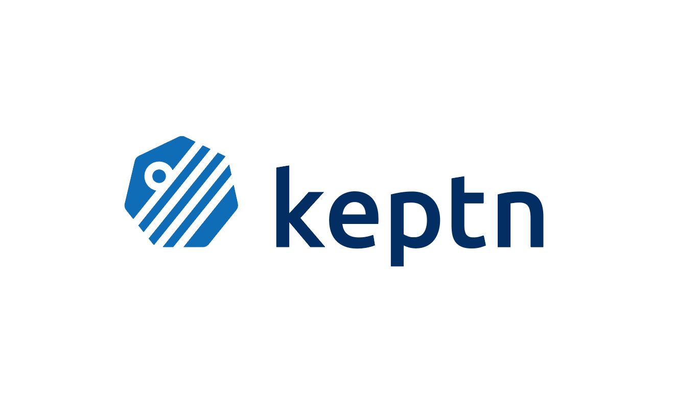

# Keptn


[](https://codecov.io/gh/keptn/keptn)
[](https://goreportcard.com/report/github.com/keptn/keptn)
[](https://bestpractices.coreinfrastructure.org/projects/3588)

Keptn is an event-based control plane for continuous delivery and automated operations for cloud-native applications. 
Please find the documentation on our [website](https://keptn.sh), and read the motivation about Keptn on our 
[Why Keptn?](https://keptn.sh/why-keptn/) page.

In addition, you can find the roadmap of the Keptn project [here](https://github.com/orgs/keptn/projects/1). It provides 
an overview of user stories that are currently in the focus of development for the next release.

## Quickstart
To get started with keptn you need a Kubernetes cluster. Supported Kubernetes engines and versions can be found [in the documentation](https://keptn.sh/docs/0.7.x/operate/k8s_support/).  
<br>
Here is a quick guide on how to get started with Keptn on [k3s](https://k3s.io/) on MacOS and Linux:

**Install K3s**  
Download, install and run K3s (tested with versions 1.16 to 1.19):
``` console
curl -sfL https://get.k3s.io | INSTALL_K3S_VERSION=v1.19.5+k3s1 K3S_KUBECONFIG_MODE="644" sh -s - --no-deploy=traefik
```
**Export the Kubernetes config using:**
``` console
export KUBECONFIG=/etc/rancher/k3s/k3s.yaml
```  

**Download keptn CLI using Bash (e.g., Linux and Mac OS)**:
```console
curl -sL https://get.keptn.sh | bash
```
or download a release for your platform from the [release page](https://github.com/keptn/keptn/releases)


**Install keptn**:
```console
keptn install --endpoint-service-type=ClusterIP --use-case=continuous-delivery
```

You can find documentation on how to get started with Keptn in our [Quick Start Guide](https://keptn.sh/docs/quickstart/) and the [Installation instructions](https://keptn.sh/docs/0.7.x/operate/install/). 
We recommend using the [latest stable release](https://github.com/keptn/keptn/releases) as provided in the [release section](https://github.com/keptn/keptn/releases).

## Community

Please find details on regular hosted community events as well as our Slack workspace in the 
[keptn/community repo](https://github.com/keptn/community).

## Keptn Versions compatibilities

We manage the Keptn *core components* in versions. The respective images in their versions are stored on [DockerHub](https://hub.docker.com/?namespace=keptn).
The versions of the Keptn *core components* and the services are compatible with each other. However, contributed services
as well as services that are not considered *core components* might not follow the same versioning schema.

Since Keptn 0.6.1, we are tracking compatibility of those services [on our website](https://keptn.sh/docs/integrations/).

You can find information on older versions 
[here](https://github.com/keptn/keptn/tree/release-0.6.0/#versions-compatibilities) and on the
 [GitHub releases page](https://github.com/keptn/keptn/releases).

## Contributions

You are welcome to contribute using Pull Requests to the respective repositories. Before contributing, please read our [Contributing Guidelines](CONTRIBUTING.md) and our [Code of Conduct](CODE_OF_CONDUCT.md).
Please also check out our list of [good first issues](https://github.com/keptn/keptn/issues?q=is%3Aopen+is%3Aissue+label%3A%22good+first+issue%22).

## License

Keptn is an Open Source Project. Please see [LICENSE](LICENSE) for more information.

## Adopters

For a list of users, please refer to [ADOPTERS.md](ADOPTERS.md).

## Further information

* The [Keptn`s website](https://keptn.sh) has the documentation of Keptn and its use cases.
* Please join the [Keptn community](https://github.com/keptn/community).
