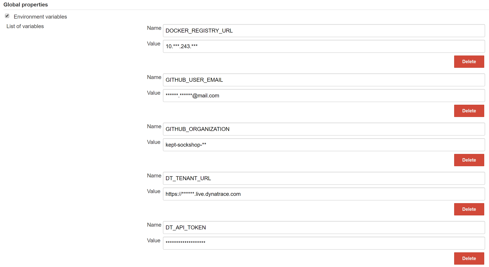
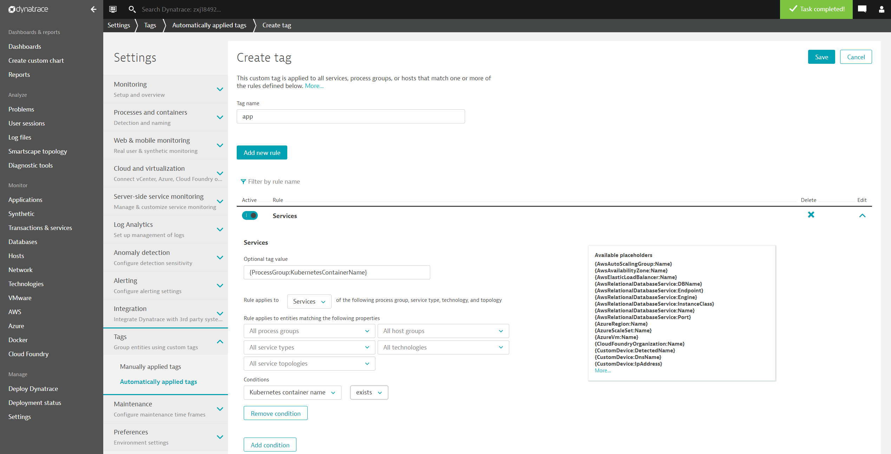

[](https://travis-ci.org/keptn/keptn)
# Keptn
Keptn is a fabric for cloud-native lifecycle automation at enterprise scale.

##### Table of Contents
 * [Step Zero: Prerequisites](#step-zero)
 * [Step One: Provision cluster on Kubernetes](#step-one)
 * [Step Two: Setup service tagging rules in Dynatrace](#step-two)
 * [Step Three: Setup process group naming rule in Dynatrace](#step-three)
 * [Step Four: Use case walk through](#step-four)
 * [Step Five: Cleanup](#step-five)

## Step Zero: Prerequisites <a id="step-zero"></a>

Keptn assumes that you have a working Kubernetes cluster in Google Container Engine (GKE). See the [Getting Started Guides](https://kubernetes.io/docs/setup/) for details about creating a cluster.

The following configuration is recommended for the k8s cluster:
    
- Master version 1.11.6 (Minimum tested master version 1.10.11)
- Node pool with 2 nodes
  - each 8vCPUs and 30 GB memory (`n1-standard-8` in GKE)
  - image type: Ubuntu (preferred) (or Container-Optimized OS (cos))
    - in case *Container-Optimized OS (cos)* is selected, make sure to [follow the instructions](https://www.dynatrace.com/support/help/cloud-platforms/google-cloud-platform/google-kubernetes-engine/deploy-oneagent-on-google-kubernetes-engine-clusters/#expand-134parameter-for-container-optimized-os-early-access) for setting up the Dynatrace OneAgent Operator. This means that after the initial setup with `setupInfrastructure.sh` (you'll find this later in this readme) the `cr.yml` has to be edited and applied again. In addition, all pods have to be restarted.

The scripts provided in this directory run in a BASH and require following tools locally installed: 
* `jq` [(download)](https://stedolan.github.io/jq/) which is a lightweight and flexible command-line JSON processor.
* `git` [(download)](https://git-scm.com/) and `hub` [(download)](https://hub.github.com/) that helps you do everyday GitHub tasks without ever leaving the terminal
* `kubectl` [(download)](https://kubernetes.io/docs/tasks/tools/install-kubectl/) that is logged in to your cluster. 
    **Tip:** View all the kubectl commands, including their options and descriptions in the [kubectl CLI reference](https://kubernetes.io/docs/user-guide/kubectl-overview/).

Additionally, the scripts need:
* `GitHub organization` to store the repositories of the sockshop application
* `GitHub personal access token` to push changes to the sockshop repositories
* Dynatrace Tenant including the Dynatrace `Tenant ID`, a Dynatrace `API Token`, and Dynatrace `PaaS Token`. If you don't have a Dynatrace tenant yet, sign up for a [free trial](https://www.dynatrace.com/trial/) or a [developer account](https://www.dynatrace.com/developer/).

## Step One: Provision cluster on Kubernetes <a id="step-one"></a>

This directory contains all scripts and instructions needed to deploy the demo application *sockshop* on a Kubernetes cluster.

1. Execute the `forkGitHubRepositories.sh` script in the `scripts` directory. This script takes the name of the GitHub organization you have created earlier. This script clones all needed repositories and uses `hub` to fork those repositories to the passed GitHub organization. Afterwards, the script deletes all repositories and clones them again from the GitHub organization.

    ```console
    $ cd ~/keptn/scripts/
    $ ./forkGitHubRepositories.sh <GitHubOrg>
    ```
    
1. Insert information in *./scripts/creds.json* by executing `defineCredentials.sh` in the `scripts` directory. This script will prompt you for all information needed to complete the setup and populate the file *scripts/creds.json* with them. 

    **Attention:** This file will hold your personal access-token and credentials needed for the automatic setup of keptn. Take care of not leaking this file! (As a first precaution we have added this file to the `.gitignore` file to prevent committing it to GitHub.)

    ```console
    $ ./defineCredentials.sh
    ```
    
1. Execute `setupInfrastructure.sh` in the `scripts` directory. This script deploys a container registry and Jenkins service within your cluster, as well as an initial deployment of the sockshop application in the *dev*, *staging*, and *production* namespaces. Please note that this is an initial step to provide you with running services in all three environments. In the course of the different use cases provided by keptn (see section [use cases](#step-four)), the microservices will be built and deployed by the Jenkins pipelines set up by keptn. 

    **Attention:** The script will create several new resources for you and will also update the files shipped with keptn. Take care of not leaking any files that will hold personal information. Including:
        
    - `manifests/dynatrace/cr.yml`
    - `manifests/istio/service_entries.yml`
    - `manifests/jenkins/k8s-jenkins-deployment.yml`

    **Note:** The script will run for some time (~10-15 min), since it will wait for Jenkins to boot before setting credentials via the Jenkins REST API.

    ```console
    $ ./setupInfrastructure.sh
    ```

1. To verify the deployment of the sockshop service, retrieve the URLs of your front-end in the dev, staging, and production environments with the `kubectl get svc` *`service`* `-n` *`namespace`* command:

    ```console
    $ kubectl get svc front-end -n dev
    NAME         TYPE            CLUSTER-IP      EXTERNAL-IP       PORT(S)           AGE
    front-end    LoadBalancer    10.23.252.***   **.225.203.***    8080:30438/TCP    5m
    ```

    ```console
    $ kubectl get svc front-end -n staging
    NAME         TYPE            CLUSTER-IP       EXTERNAL-IP      PORT(S)           AGE
    front-end    LoadBalancer    10.23.246.***    **.184.97.***    8080:32501/TCP    6m
    ```

    ```console
    $ kubectl get svc front-end -n production
    NAME         TYPE            CLUSTER-IP       EXTERNAL-IP      PORT(S)           AGE
    front-end    LoadBalancer    10.23.248.***    **.226.62.***    8080:32232/TCP    7m
    ```

1. Run the `kubectl get svc` command to get the **EXTERNAL-IP** and **PORT** of Jenkins. Then user a browser to open Jenkins and login using the default Jenkins credentials: `admin` / `AiTx4u8VyUV8tCKk`. **Note:** It is highly recommended to change these credentials right after the first login.

    ```console
    $ kubectl get svc jenkins -n cicd
    NAME       TYPE            CLUSTER-IP      EXTERNAL-IP       PORT(S)                            AGE
    jenkins    LoadBalancer    10.23.245.***   ***.198.26.***    24***:32478/TCP,50***:31867/TCP    10m
    ``` 

1. To verify the correct installation of Jenkins, go to the Jenkins dashboard where you see the following pipelines:
    * k8s-deploy-production
    * k8s-deploy-production-canary
    * k8s-deploy-production-update
    * k8s-deploy-staging
    * Folder called sockshop

1. Finally, navigate to **Jenkins** > **Manage Jenkins** > **Configure System** and  scroll to the environment variables to verify whether the variables are set correctly. **Note:** The value for the parameter *DT_TENANT_URL* must start with *https://*



## Step Two: Setup service tagging rules in Dynatrace <a id="step-two"></a>

This step creates tagging rules based on Kubernetes pod name and namespaces.
These rules allow you to query service-level metrics such as response time, failure rate, or throughput automatically based on meta-data that you have passed during a deployment, e.g.: *Deployment Stage* (dev, staging, or production). 

1. Login in to your Dynatrace tenant.

1. Create service tag for app name based on Kubernetes container name
    1. Go to **Settings**, **Tags**, and click on **Automatically applied tags**.
    1. Create a new custom tag with the name `app`.
    1. Edit that tag and **Add new rule**.
        * Optional tag value: `{ProcessGroup:KubernetesContainerName}`
        * Rule applies to: `Services` 
        * Condition on `Kubernetes container name` if `exists`
    1. Click on **Preview** to validate that the rule works.
    1. Click on **Save** for the rule and then **Done**.

1. Create service tag for environment based on Kubernetes namespace
    1. Go to **Settings**, **Tags**, and click on **Automatically applied tags**.
    1. Create a new custom tag with the name `environment`.
    1. Edit that tag and **Add new rule**.
        * Optional tag value: `{ProcessGroup:KubernetesNamespace}`
        * Rule applies to: `Services` 
        * Condition on `Kubernetes namespace` if `exists`
    1. Click on **Preview** to validate that the rule works.
    1. Click on **Save** for the rule and then **Done**.

    Screenshot shows rule for app tag.
    

## Step Three: Setup process group naming rule in Dynatrace <a id="step-three"></a>

1. Create a naming rule for process groups
    1. Go to **Settings**, **Process and containers**, and click on **Process group naming**.
    1. Create a new process group naming rule with **Add new rule**. 
    1. Edit that rule:
        * Rule name: `Container.Namespace`
        * Process group name format: `{ProcessGroup:KubernetesContainerName}.{ProcessGroup:KubernetesNamespace}`
        * Condition: `Kubernetes namespace`> `exits`
    1. Click on **Preview** and **Save**.

    Screenshot shows this rule definition.
    

## Step Three: Use case walk through <a id="step-four"></a>

To explore the capabilities of keptn, follow the provided use cases that are dedicated to a special topic.

* [Performance as a Service](./usecases/performance-as-a-service): This use case aims on moving from manual sporadic execution and analysis of performance tests to a fully automated on-demand self-service testing model for developers.

* [Production Deployments](./usecases/production-deployments): This use case gives an overview of production deployments, deployment strategies, and showcases those using Istio on Kubernetes to canary-deploy a new front-end version.

* [Runbook Automation and Self-Healing](./usecases/runbook-automation-and-self-healing): This use case gives an overview of how to leverage the power of runbook automation to build self-healing applications. 

* [Unbreakable Delivery Pipeline](./usecases/unbreakable-delivery-pipeline): The overall goal of the *Unbreakable Delivery Pipeline* is to implement a pipeline that prevents bad code changes from impacting real end users.

## Step Four: Cleanup <a id="step-five"></a>

1. To clean up your Kubernetes cluster, execute the `cleanupCluster.sh` script in the `scripts` directory.

    ```console
    $ ./scripts/cleanupCluster.sh
    ```
