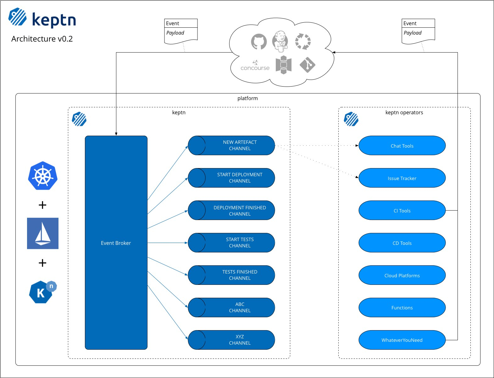

# keptn Architecture v0.2

keptn will run on Knative, which requires Kubernetes and Istio. The **Event Broker** will be implemented as a Kubernetes Service. We found that event timeouts, e.g. from GitHub webhooks, make the event delivery unreliable when using Knative services that scale up from 0 instances upon receiving an event. We'll continue to investigate this.

The **Channels** will be implemented using Knative Channels.

The **Services** will be implemented using Knative Services that subscribe to channels.

## Event Broker
Listens for and, if necessary, transforms third party events to keptn events and forwards them to the right channel.

## Channels
Keptn provides channels for events in a continuous delivery process. These channels should exclusively work with keptn events. Services can subscribe to channels to receive these events.

## Services
Services subscribe to channels and are triggered by events on said channel. The service executes a specific action based on the event type and its payload. This action can be executed directly in the service, e.g. sending a message to a Slack channel (fire-and-forget). Alternatively, the service sends an event to a third party tool that executes the action and notifies keptn of the outcome.
