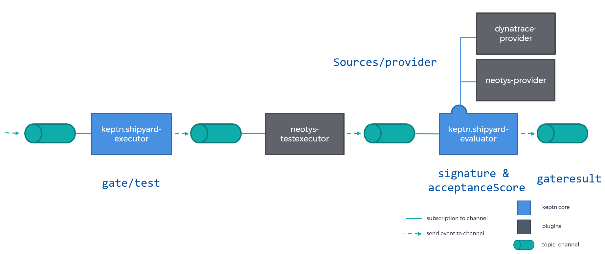

# Shipyard
Shipyard evolved out of the **Monitoring as Code** and **Performance Signature** work done by Dynatrace, Dynatrace customers & partners. Discussions and observations of what others have been doing in the market we came up with several use cases that Shipyard should support in the future. 

**Minimum Viable Product/Featureset: Automate Quality Gates**
The most basic goal and *minimum viable feature* is defining the criteria for an automated quality gate as services get pushed through different deployment stages.

#### Additional Use Cases: For future considerations
All use cases were presented first at Neotys PAC 2019. See slides and video recording once published here: https://www.neotys.com/performance-advisory-council/andreas-grabner. To list a few:

* Automated Test Generation
* Automated Baseline Definition for Alerting
* Automated Environment Health Checks
* Automated Synthetic Production SLA Monitoring

## Example Files
In the shipyard subdirectory, you find two sample shipyard files that define two different types of quality gates: (1) a pure functional quality gate and (2) a quality gate focused on performance:

1. [shipyard_sockshop_carts_dev_func.json](./shipyard/shipyard_sockshop_carts_dev_func.json)
2. [shipyard_sockshop_carts_dev_perf.json](./shipyard/shipyard_sockshop_carts_dev_perf.json)

## MVP Use Case: Automated Quality Gates
Shipyard allows developers to define which tests to execute in a deployment stage and which metrics to evaluate to automatically quality rate the current build artifact/deployment. Shipyard therefore introduces the following concepts:

* A definition of metrics to evaluate
* Thresholds and rating criteria for each metric
* Tests to execute after which these metrics get evaluated

#### Metric Sources

As metrics can come from all sorts of tools, e.g., APM, Infrastructure Monitoring, Testing Tools, Cloud or PaaS Platforms, etc., we allow metrics to be provided by different metric providers, e.g., Dynatrace, Neoload, Prometheus, and so on. Here is an example section for metric sources:

```json
"sources": [
    {
        "provider": "dynatrace",
        "metrics": [
            {
                "id": "Avg_FailureRate_Carts",
                "query": {
                    "timeseriesId": "com.dynatrace.builtin:service.failurerate",
                    "aggregation": "avg",
                    "tags": ["service:$service", "app:$app", "environment:$environment"]
                }
            }
        ]
    },
```

The above example defines a section for metric provider *dynatrace*. It contains a metric with the id *Avg_FailureRate_Carts* and query details that are specific to Dynatrace. Every metric provider can have their own set of query parameters. You also see that we can work with parameters which can be defined globally in the Shipyard file.

#### Performance Signature (=Threshold & Score)

While there are many approaches to evaluate metric values and whether they behave as expected or not (static thresholds, behavior, ...) we decided to start with static thresholds for the first iteration of Shipyard, allowing users to define upper and lower boundaries for warning and severe. If a metric doesn't exceed any boundary, it gets the full metric score. If it exceeds warning, it only gets half the score and if it exceeds severe it gets a score of 0. The maximum score for a metric must be defined in Shipyard. Here is an example

```json
"signature": [
    {
        "metricsId": "Avg_FailureRate_Carts",
        "thresholds": {
            "upperSevere": 10,
            "upperWarning" : 5
        },
        "metricScore": 50
    },
```
The example above defines that *Avg_FailureRate_Carts* should get a score of 50 in case the value - once evaluated - is below 5. If the value is between 5 & 10 it will score 25 (half of 50) and if it exceeds 10 it will get 0 points. A signature can include several metric and threshold definitions. When evaluated, all metric values are compared against the threshold definition and an overall score is calculated. 

#### Gate Definition (= Tests & Acceptance Score)
The last piece of the puzzle is to define what tests to execute in a gate and what score needs to be achieved to accept the build and pass that gate successfully.
For this, we define a gate that includes a definition of a test to be executed and, once tests are executed, calculates the overall Acceptance Score of the Quality Gate based on the performance signature definition. Here is an example:

```json
"gate": {
    "tests": ["neotys.executor $testname"],
    "acceptanceScore": {
        "pass": 65,
        "warning": 45
    }
},
```
The example above defines a gate that will first trigger the neotys.executor which will run the defined test case. Upon successful completion the Shipyard Evaluator will calculate the overall acceptanceScore and matches it with any of the defined score labels. For example, if the overall score is >= 65 the deployment is considered **pass**. If it is between 45 and 65, it is considered **warning**. If it is below 45, it is considered **failed**.

## Implemention in keptn: Workflow
Evaluating Shipyard is a core capability of keptn. The following illustrates the general workflow from:

1. kicking off an executor (e.g., through a deployment event from CI or a request through the keptn-cli)
2. executing the tests specified in the gate
3. triggering the actual evaluation when tests are done -> this pulls data from metric source providers
4. sending final gate result 



## Usage through the keptn CLI
In order to provide Shipyard capabilities to other tools and users we provide a CLI that can kickoff the execution and is able to provide feedback on the result. Here is a proposal for these calls:

```console
$ keptn shipyard execute myshipyard.json
Started gate validation for myshipyard.json ...
Token: SHIPYARD-12345-123-ABCDE

$ keptn shipyard status SHIPYARD-12345-123-ABCDE
The crew has not yet been able to validate shipyard. Check back later!

$ keptn shipyard status SHIPYARD-12345-123-ABCDE
Gate Status: pass
Total Score: 70
```

Here is another option to specify the a custom callback:

```console
$ keptn shipyard execute myshipyard.json --r https://myshipyardcallback:8080/shipyardresult
Started gate validation for myshipyard.json ... registered result webhook https://myshipyardcallback:8080/shipyardresult
Token: SHIPYARD-12345-123-ABCDE
```

We are proposing a couple of parameters for the CLI to enable additional use cases:
```
#1: Overwriting parameter values, e.g., pass in a different test or environment name 
--p parameter1=value1

#2: Getting the raw metric values, e.g., allows a CI Plugin to not only show the final result but all evaluated data points
--output raw
```

## Additional Use Cases

In the shipyard folder you find additonal sample files for additional use cases that go beyond Quality Gates:
* [Automatic Endpoint Test Generation: shipyard_sockshop_carts_dev_perf.json](./shipyard/shipyard_sockshop_carts_dev_perf.json)

### Use Case: Automatic API Endpoint Test Generation
This use cases enables automatic generation of endpoint test cases that can either be used for functional health checks as well as for SLA validation in production!
```
    "endpoints": [ {
        "id": "postitems",
        "url": "/items",
        "method": "POST",
        "params": [{
            "itemid": "1"
        }, {
            "count": "2"
        }],
        "headers": [{
            "Content-Type": "application/json",
            "Cache-Control": "no-cache"
        }]
    }]
```
The example abovev allows e.g: a test executor to generate an API Endpoint test script on-the-fly and execute them as part of the quality gate test execution.
The same example can be used when deploying into production by setting up Synthetic Tests for these endpoints.

### Use Case: Automatic Test Scenario Generation
Building on top of Automatic API Endpoint definition, this use cases goes a step further and defines a testing scenarios. A Test Scenario is a sequence of endpoint API calls. This can be used for both function scenario testing as well as for load testing. 
```
    "scenarios": [{
        "id": "addremovecart",
        "steps": [{
                "endpointid": "postitems",
                "input": "body={productId=$PRODUCTID&count=$COUNT}",
                "output": "{totalItems: $$TOTALITEMS}",
                "validate": "$TOTALITEMS==$COUNT"
            },
            {
                "endpointid": "getitems",
                "output": "{totalItems: $TOTALITEMS}",
                "validate": "$TOTALITEMS==$COUNT"
            },
            {
                "endpointid": "postitems",
                "input": "body={productId=$PRODUCTID$count=0}",
                "output": "{totalItems: $$TOTALITEMS}",
                "validate": "$TOTALITEMS==0"
            }
        ],
        "behavior" : [
            {
                "id" : "10vu_5min_5min",
                "workload" : {
                    "initialvu" : 1,
                    "rampuptovu" : 10,
                    "rampuptime" : 5,
                    "steadystate" : 5
                },
                "expected" : {
                    "throughput" : 400
                }
            }
        ]
    }]
```
The example above defines a scenario that adds and removes an item from the shopping cart by calling the correct sequence of API Endpoints. Input parameters can be used as shown for our quality gates. We extend it with also output parameters which can then be used again as input parameters in subsequent calls int he scenarios.
The example above also shows that we can define different workload behaviors. This allows us to define different workloads, e.g: Single User Functional Check or 10 Virtual Users for 5 minutes.