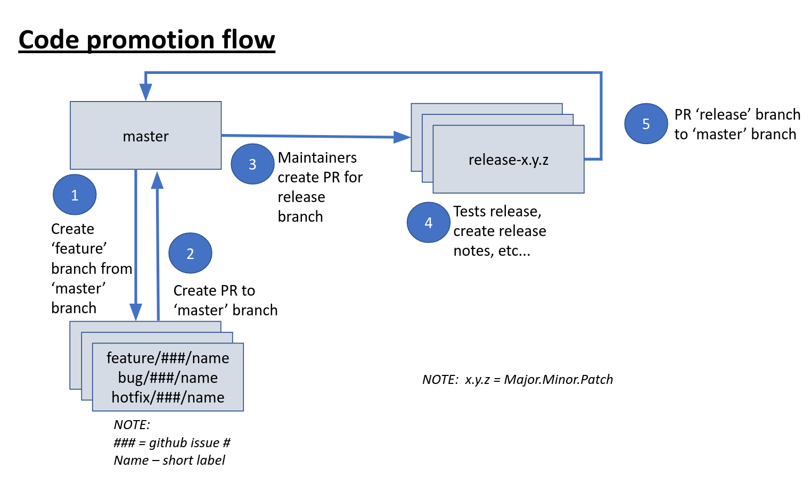

# Keptn Developer Docs

This folder contains docs for developers. If you are looking for the usage documentation of Keptn, or the `keptn` CLI, 
 please take a look at the [keptn.sh](https://keptn.sh) website.

## Requirements

* You have completed the [Keptn Quickstart Tutorial](https://keptn.sh/docs/quickstart/) and you have successfully
  onboarded a service (etc...)
* Kubernetes Cluster: 
  For testing your changes it is strongly recommended to have access to a (throwaway) Kubernetes Cluster on any of the 
  supported platforms (e.g., Google Kubernetes Engine, Azure Kubernetes Service). 
  You can also run Keptn on Minikube and Minishift, which is the recommended way for developing and running integration tests.
  You can find more information in [here](integration_tests.md).
* Kubernetes CLI tool [kubectl](https://kubernetes.io/docs/tasks/tools/install-kubectl/)
* Docker
* Dockerhub Account (any other container registry works too)
* Go (Version 1.13.x)
* GitHub Account (required for making Pull Requests)
* If you want to use in-cluster debugging, please take a look at our [debugging guide](debugging.md).

### IDE / Code Editor

While this is not a requirement, we recommend you to use any of the following

* Visual Studio Code (with several Go Plugins)
* JetBrains GoLand (with Google Cloud Code)

## Where to go

Keptn consists of multiple services. We recommend to take a look at the 
[architecture of keptn](https://keptn.sh/docs/0.5.0/concepts/architecture/).

The keptn core implementation as well as the *batteries-included* services are stored within this repository 
([keptn/keptn](https://github.com/keptn/keptn)). This includes (but is not limited to):

* cli
* installer
* api
* eventbroker
* bridge
* configuration service
* gatekeeper service
* evaluation service
* datastore

The `go-utils` package is available in [keptn/go-utils](https://github.com/keptn/go-utils/) and contains several 
 utility functions that we use in many services.

If you want to contribute to the website or docs provided on the website, the 
 [keptn/keptn.github.io](https://github.com/keptn/keptn.github.io/) is the way to go.

In addition, we have a collection of additional services at [github.com/keptn-contrib](https://github.com/keptn-contrib), e.g.:
* [dynatrace-service](https://github.com/keptn-contrib/dynatrace-service)
* [dynatrace-sli-service](https://github.com/keptn-contrib/dynatrace-sli-service)
* [prometheus-sli-service](https://github.com/keptn-contrib/prometheus-sli-service)

## Branch Naming Convention

We aim to follow some rules for branch names within our repositories:

* **master** contains the latest (potentially unstable) changes from development
* **release-x.y.z** contains the release x.y.z
* **feature/###/name**, **bug/###/name**, **patch/###/name**, **hotfix/###/name** (where ### references the github issue number) contains 
  code for branches that are under active development.

We are following the git branching model described in [this blog post](https://nvie.com/posts/a-successful-git-branching-model/).
For instance, if a new feature or bug branch is created, the workflow is to create a new branch of the **master** 
 branch, and  name it according to the convention listed above. Once ready, a new Pull Request should be created with 
 the **master** branch as a target. Hotfixes work similar, but should be branched away from the **master** branch. PRs
 for hotfixes should be created to the **master** and respective **release-** branches, ensuring that the latest release
 and the current development version use the fix.
  

## Travis CI Pipeline: Releases, Nightlies, etc...

We have automated builds for several services and containers using Travis-CI. This automatically creates new builds for

* every [Github Release](https://github.com/keptn/keptn/releases) tagged with the version number (e.g., 0.5.0),
* every change in the [master branch](https://github.com/keptn/keptn/tree/develop) (unstable) tagged as **latest** as 
  well as the build-datetime,
* every pull request (unstable).

You can check the resulting images out by looking at our [DockerHub container registry](https://hub.docker.com/u/keptn)
 and at the respective containers.

If you are interested, the build process is described in the [.travis.yml](/.travis.yml) file.
