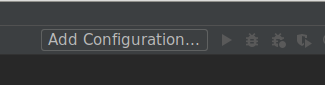
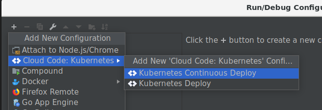
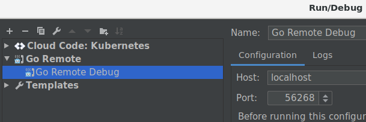

# GOLANG Debugging Guide for Keptn

## Pre-Requisites

* GoLand IDE (VSCode might work too, this guide was written for GoLand however)
* [Cloud Code](https://plugins.jetbrains.com/plugin/8079-cloud-code/) Plugin for GoLand
* skaffold (see https://skaffold.dev/docs/install/ for details)
* Kubernetes cluster with keptn installed and running
* Container registry (e.g., dockerhub)

## Repo-Setup

Most of our services should already have a working setup. But just in case the setup is not there yet, the following 
 steps are required:
 
1. Add Kubernetes Deployment YAML Files (e.g., deploy/service.yaml) - note down the image name (e.g., `keptn/some-go-service:latest`)
1. Compile your go binary using buildflags `-gcflags "all=-N -l"`
1. Add `libc6-compat` to alpine using `apk add --no-cache libc6-compat`
1. Do not use ENTRYPOINT scripts in Dockerfile
1. Make sure CMD in Dockerfile refers to the go-binary that you want to debug. Here is an example Dockerfile:
    ```dockerfile
    FROM golang:1.12 as builder
    
    WORKDIR /go/src/github.com/keptn-contrib/some-go-service
    
    ENV GO111MODULE=on
    COPY go.mod go.sum ./
    RUN go mod download
    COPY . .
    
    # Build the command inside the container.
    RUN GOOS=linux go build -gcflags "all=-N -l" -v -o some-go-binary
    
    # Use a Docker multi-stage build to create a lean production image.
    FROM alpine:3.7
    # we need to install ca-certificates and libc6-compat for go programs to work properly
    RUN apk add --no-cache ca-certificates libc6-compat
    
    # Copy the binary to the production image from the builder stage.
    COPY --from=builder /go/src/github.com/keptn-contrib/some-go-service/some-go-binary /some-go-binary
    
    EXPOSE 8080
    
    # required for external tools to detect this as a go binary
    ENV GOTRACEBACK=all
    
    CMD ["/some-go-binary", "other", "params", "--foobar"]
    ```
1. Add a skaffold.yaml with the following content (note that the image name should not contain a tag):
    ```yaml
    Version: skaffold/v1beta13
    kind: Config
    build:
      artifacts:
        - image: keptn/some-go-service
          docker:    # 	beta describes an artifact built from a Dockerfile.
            dockerfile: Dockerfile
            buildArgs:
              debugBuild: true
    deploy:
      kubectl:
        manifests:
          - deploy/service.yaml

    ```

**Note**: Only use manifests for deployments (not for namespaces, etc...)

## Debugging Step by Step

### Setup GoLand with Cloud Code
1. Install [Cloud Code](https://plugins.jetbrains.com/plugin/8079-cloud-code/) in GoLand (Settings / Plugins / Search for Cloud Code and hit install)
1. Once installed, restart your IDE.
1. After restarting, click on Tools / Cloud Code / Kubernetes / Add Kubernetes Support

To verify that the installation has worked you should see the **Kubernetes Explorer** on the right side of your IDE.

### Create a Kubernetes Continuous Deploy Run Configuration

1. Open the Dialog to configure/edit Run Configurations in your IDE.
  
1. Click on the plus and select Cloud Code: Kubernetes / Kubernetes Continuous Deploy
  
1. Give this configuration a self-explanatory name and select your **skaffold.yaml** configuration file.
1. Save your configuration and close the dialog.

### Debug now!

1. Select the configuration in your dropdown and click on the Debugger icon (do not use the Run icon). This will build and deploy the docker image.
1. Watch the output, it should finally report something along the lines of
    ```
    [some-go-service-5d678c9cd9-5hb5n install-go-support] Installing runtime debugging support files in /dbg
    [some-go-service-5d678c9cd9-5hb5n install-go-support] Installation complete
    [some-go-service-5d678c9cd9-5hb5n install-go-support] <Container was Terminated>
    Port forwarding pod/some-go-service-5d678c9cd9-5hb5n in namespace keptn, remote port 8080 -> local port 8080
    Port forwarding pod/some-go-service-5d678c9cd9-5hb5n in namespace keptn, remote port 56268 -> local port 56268
    [some-go-service-5d678c9cd9-5hb5n some-go-service] some-go-service server listening at: 127.0.0.1:56268
    ```
1. You should now be able to add a Go Remote Debugger in GoLand which should connect to the port mentioned above (e.g., `56268`).
  . 
  Make sure to start the debugger by selecting the run configuration and pressing the Debug icon. If you have any 
  breakpoints, they should be triggered as soon as you access the service. 


**Note**: The deployed application has a port-forward on port 8080 (as this was the port defined in the Dockerfile above).
 The service won't be available on port 8080 until you have connected your debugger.