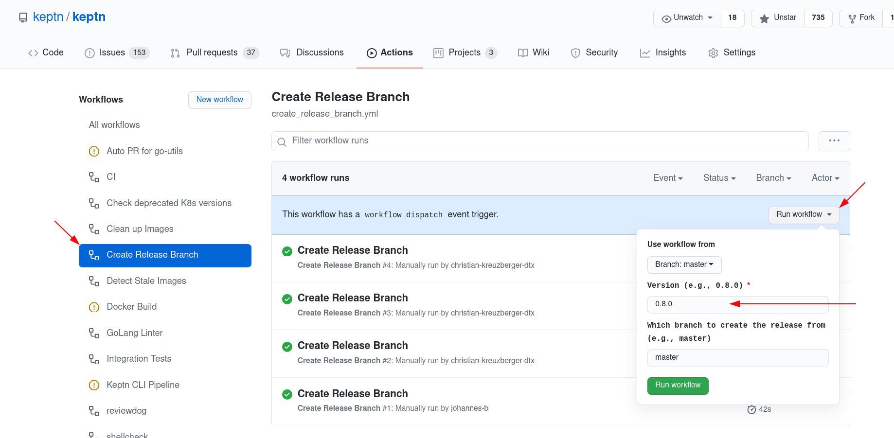
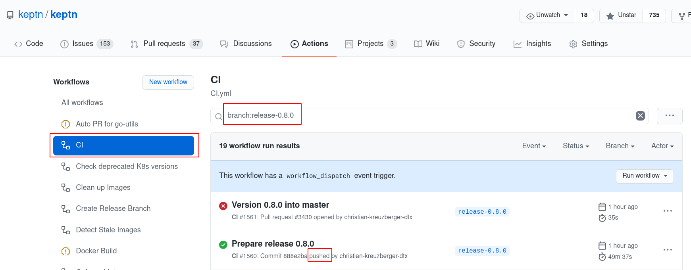
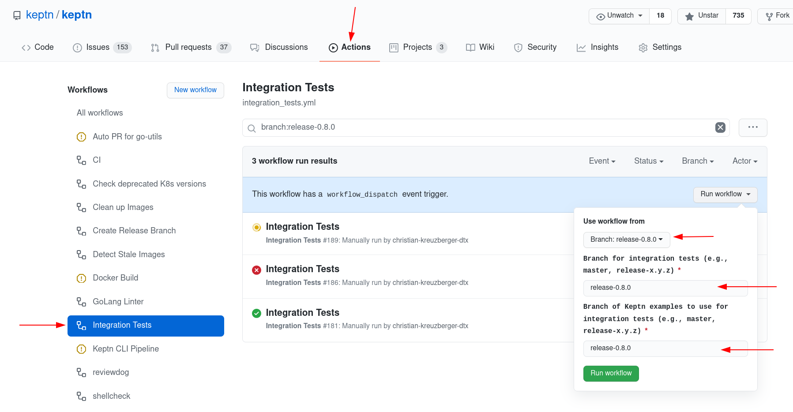

# How to create a new Keptn release using GH Actions

## Pre-requesits

* Finish all tasks / issues in the milestone
* Follow the [Release Checklist](https://github.com/keptn/keptn/wiki/Release-Checklist)

## Pull a release-branch

* Go to [Actions](https://github.com/keptn/keptn/actions) and on the left side select "Create Release Branch"
  
* On the right side, click on "Run workflow".
* In the dropdown, enter a semantic version for the new release (e.g., 0.8.0)
* Click on Run Workflow, and wait a couple of seconds until the workflow run appears in the list

Once the workflow has finished, you should see

- [ ] A release-x.y.z branch
- [ ] A PR from release-x.y.z to master

## Wait for CI to finish

Once the branch and the PR have been made, the CI should run for the `push` (*Note*: we have disabled the CI for PRs from release branches):

Once it has run successfully (green tick), the following artifacts should be available:

* Docker Images on DockerHub tagged with the version (e.g., 0.8.0)
* CLI binaries within the CI Artifacts
* Helm Charts within the CI Artifacts

## Run Integration Tests

Finally we should run integration tests for this release.

* Go to [Actions](https://github.com/keptn/keptn/actions) and on the left side select "Integration Tests"
* On the right side, click on "Run workflow".
* In the dropdown, enter the respective branch names, e.g.:
  
* Click on Run Workflow, and wait a couple of seconds until the workflow run appears in the list

Integration tests take roughly 30 - 45 minutes to complete. Once they are completed, you should see a Draft Release on GitHub.

## Verify the release

Please verify the release according to the release checklist.

