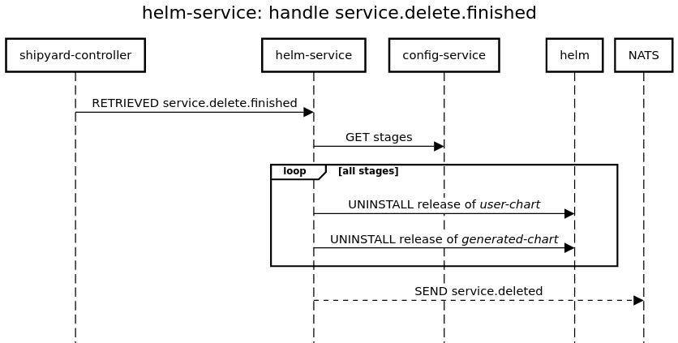
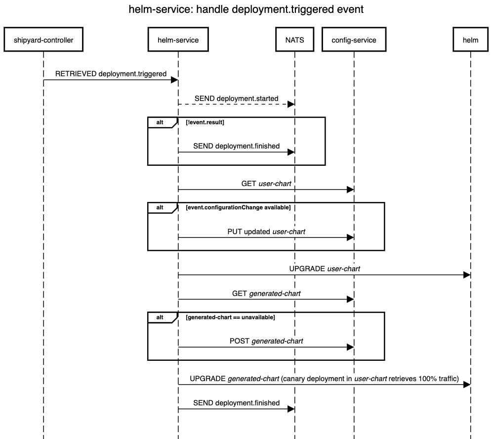
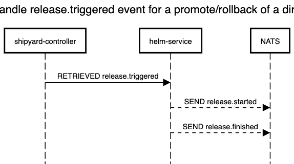
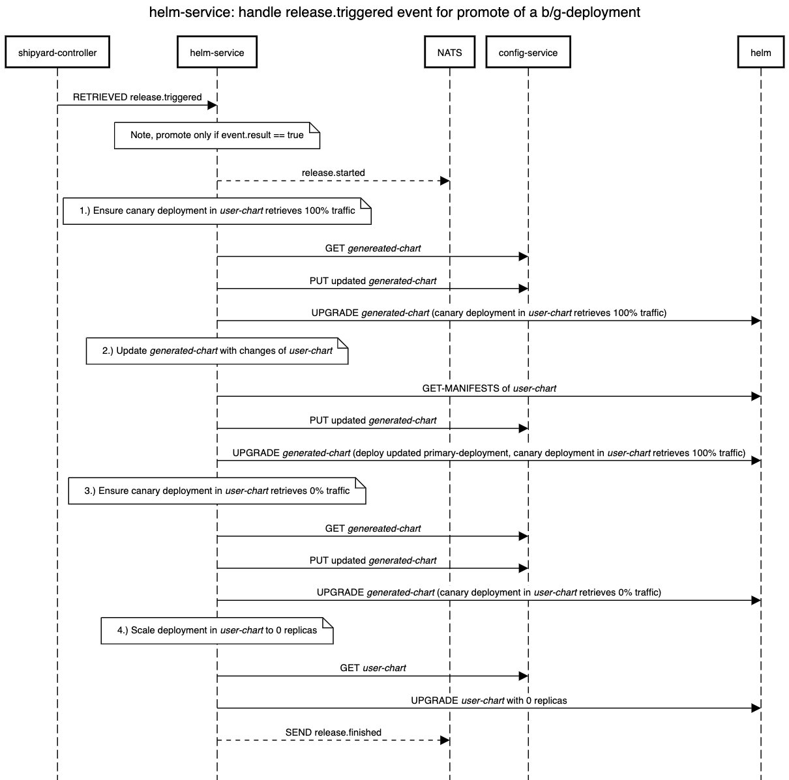
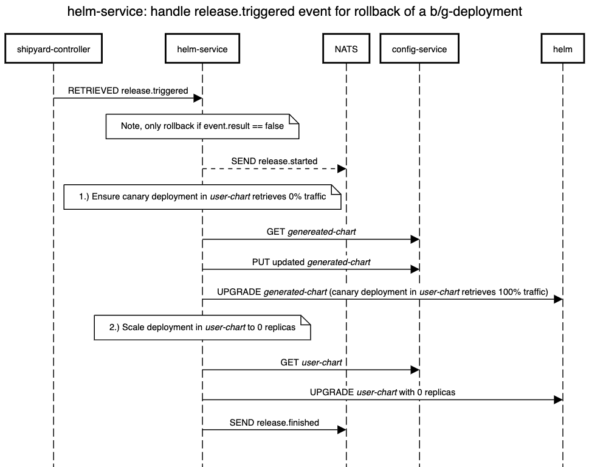
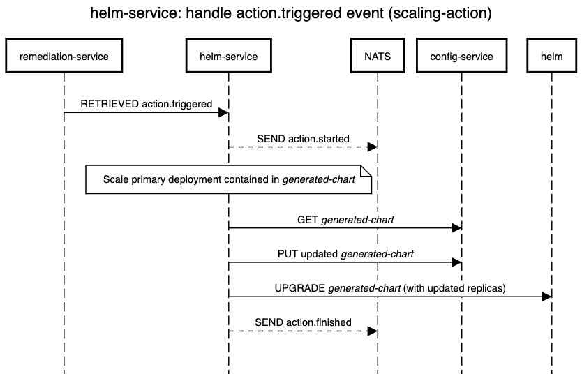

# Helm Service

The *helm-service* allows deploying services to a Kubernetes cluster and releasing them to user traffic.
Therefore, these services have to be packed as [Helm charts](https://helm.sh/docs/topics/charts/).
For details about the Helm chart and how to onboard a service, please checkout the [docs](https://keptn.sh/docs/0.7.x/manage/service/#onboard-a-service).

In order to deploy and release services to user-traffic, the *helm-service* implements two tasks:
1. Deployment task: Here, the `helm-service` executes a 
Helm upgrade on the Helm chart provided by the user. Furthermore, the `helm-service` routes traffic to this new version. 
1. Release task: Here, the `helm-service` 
either promotes or rolls back the new version depending on the (evaluation) result.  

## Installation

The *helm-service* is part of the *Execution Plane for Continuous Delivery*.

You can find installation instructions [here](https://keptn.sh/docs/0.8.x/operate/install/#install-keptn).

To install it next to your Keptn installation, you can use the following command:

```console
helm install helm-service https://github.com/keptn/keptn/releases/download/0.8.4/helm-service-0.8.4.tgz -n keptn
```

## Development

You can use `skaffold run --tail` to build and deploy from this directory.

## Handled events
The *helm-service* handles a set of events. The following sequence diagrams describe the respectively executed actions
and the involved components.

### Handling of `sh.keptn.event.service.created` events
The `sh.keptn.event.service.created` event states that a new Keptn service has been created by the `shipyard-controller`.
This event can contain a Helm chart (in case Keptn is used for Continuous Delivery).
The `helm-service` processes this chart and stores it in the Git repo.


  

### Handling of `sh.keptn.event.service.deleted` events
The `sh.keptn.event.service.deleted` event states that a Keptn service has been deleted by the `shipyard-controller`.
In case this service was deployed by the `helm-service`, the `helm-service` uninstalls all releases of this Keptn service.



### Handling of `sh.keptn.event.deployment.triggered` events
The `sh.keptn.event.deployment.triggered` event states that a new deployment has been triggered e.g. by the user.
The `helm-service` executes a Helm upgrade on the Helm chart provided by the user, i.e. the `user-chart`
and routes traffic to this new version.



### Handling of `sh.keptn.event.release.triggered` events
The `sh.keptn.event.release.triggered` event states that a release has been triggered.

For a direct deployment, the `helm-service` does not have to apply anything. 



For a b/g deployment with an (evaluation) result equals pass or warning, the `helm-service` promotes the new version
to be stable.



For a b/g deployment with an (evaluation) result equals fail, the `helm-service` rolls back the new version.




### Handling of `sh.keptn.event.action.triggered` events
The `sh.keptn.event.action.triggered` event stats that a remediation action has been triggered.
The `helm-service` provides a replica scaling remediation action.

