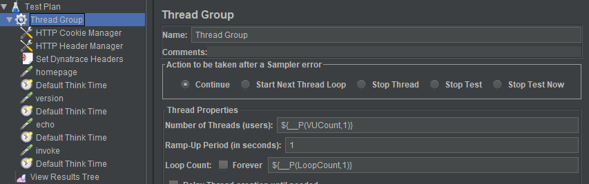
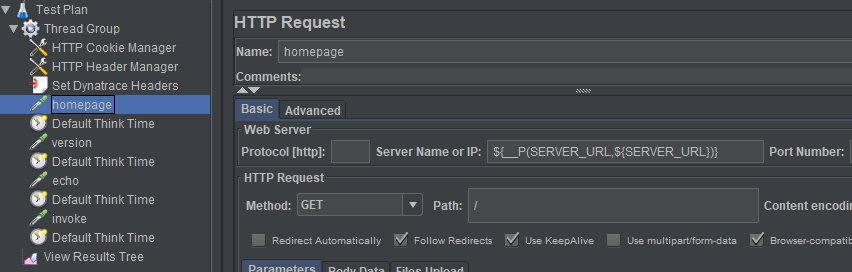
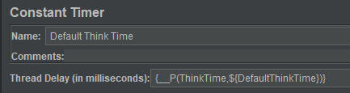
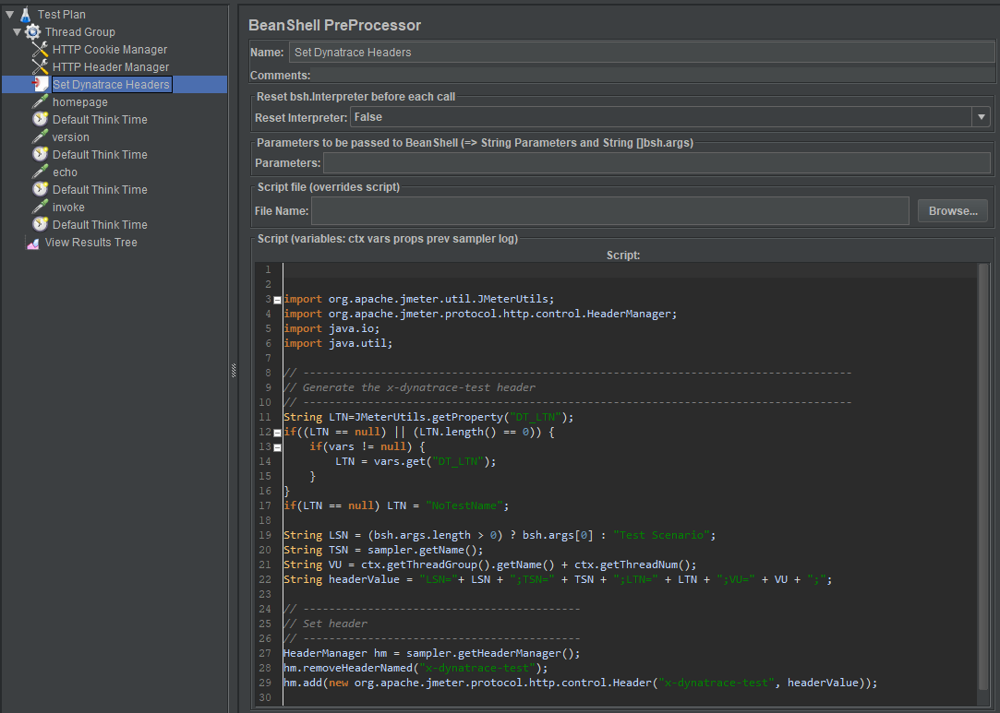

# JMeter Service

[](https://goreportcard.com/report/github.com/keptn-contrib/jmeter-extended-service)

The *jmeter-service* has been updated with the implementation from the Keptn-Sandbox Project *jmeter-extended-service* 
*jmeter-extended-service* provides extended capabilities around custom workload definitions and executions.
The goal is to use this Sandbox project to provide finalize and proof these new capabilities to be valuable to the Keptn community and at a later point merge it into the JMeter Keptn Core project!

The *jmeter-extended-service* listens to Keptn events of type:
- `sh.keptn.events.deployment-finished`

In case the tests succeeed, this service sends a `sh.keptn.events.test-finished` event with `pass` as `result`. In case the tests do not succeed (e.g., the error rate is too high), this service sends an `sh.keptn.events.test-finished` event with `fail` as `result`.

## Compatibility Matrix

| Keptn Version    | JMeter Service for Keptn |
|:----------------:|:----------------------------------------:|
|       0.6.1      | keptn/jmeter-service:0.6.1 |
|       0.6.2      | keptn/jmeter-service:0.6.2 |

## Installation

The *jmeter-service* can be installed on a Keptn Quality Gate only installation

### For Quality Gate Only Installs: Deploy jmeter-extended-service

To deploy the current version of the *jmeter-extended-service* in your Keptn Kubernetes cluster, use the file `deploy/service.yaml` from this repository and apply it:

```console
kubectl apply -f deploy/service.yaml
```
If you want to delete the service do this
```console
kubectl delete -f deploy/service.yaml
```

## Usage

The JMeter service expects JMeter test files in the project specific Keptn repo. It expects those files to be available in the jmeter subfolder for a service in the stage you want to execute tests. 
Here is an example on how to upload the basiccheck.jmx test file via the Keptn CLI to the dev stage of project sockshop for the service carts:
```
keptn add-resource --project=sockshop --stage=dev --service=carts --resource=jmeter/basiccheck.jmx --resourceUri=jmeter/basiccheck.jmx
```

### Workloads

When the JMeter service is handling the sh.keptn.events.deployment-finished it will execute different tests with different workload parameters depending on the teststrategy. 
Following is a table that shows you which tests are executed and which parameters are passed to the JMeter script. You notice that independent of the test strategy the JMeter service will always first execute the basiccheck.jmx if it exists. The basiccheck is there to make sure the service is even available and not returning any errors. This is like a quick health check by running the script and making sure there is a 0% failure rate.
If that health check fails the main load.jmx will not be executed as it doesnt make sense if the service is not healthy! If it succeeds load.jmx will be executed. Here the accepted failure rate will also be validated and based on that the JMeter service either returns pass or fail in the result value back to keptn as part of the tests.finished event

| Test Strategy | Test Script     | VUCount | LoopCount | ThinkTime | Accepted Failure Rate |
| ------------- | -----------     | ------- | --------- | --------- | --------------------- |
| functional    | basiccheck.jmx  | 1       | 1         | 250       | 0 |
|               | load.jmx        | 1       | 1         | 250       | 0.1 |
| performance   | basiccheck.jmx  | 1       | 1         | 250       | 0 |
|               | load.jmx        | 10      | 500       | 250       | 0.1 |

These workload parameters including information about the to be tested service url and port are passed to the JMeter script as properties.
Here is an overview:
| Property Name | Description | Sample Value |
| ------------- | ----------- | ------------ |
| PROTOCOL      | Protocol    | https |
| SERVER_URL    | Value passed in deploymentURILocal or deploymentURIPublic | carts.staging.svc.local |
| CHECK_PATH    | This is meant for the basiccheck.jmx and defines the URL that shoudl be used for the health check | /health |
| SERVER_PORT   | Port to be tested against | 8080 |
| DT_LTN        | A unique test execution name. To be used for integrations with tool such as Dynatrace | performance_123 |
| VUCount       | Virtual User Count | 10 |
| LoopCount     | Loop Count | 500 |
| ThinkTime     | Think Time | 250 | 

If you look at the sample files that come with the Keptn Tutorials you will notice that the basiccheck.jmx and load.jmx leverage all these parameters. In the end though it is up to you on whether you want to use these or hard code them into your jmx scripts.
Here a couple of screenshots from one of the JMeter files so you see how these parameters can be used in your script:








### Custom Workloads

Since the first implementation of the JMeter-Service we got requests of making the workloads easier configurable. Instead of the hard coded VUser, LoopCount ... the request came in to configure this through a confiuration file stored along with the test scripts.
A second request was around "Performance Testing as a Self-Service" where users wanted to have more than just one performance testing workload. You often want to just run a test with 10 users, then one with 50 and then with 100. Instead of changing these values in the JMX file before each run users demanded to specify these settings as custom workloads which should be executable via Keptn.

If you want to overwrite the defaults or define your own custom workloads you can do this by storing a jmeter.conf.yaml file in the same jmeter subfolder next to your scripts. Here is an example of such a file:
```
---
spec_version: '0.1.0'
workloads:
  - teststrategy: performance
    vuser: 100
    loopcount: 10
    script: jmeter/load.jmx
    acceptederrorrate: 1.0
  - teststrategy: performance_light
    vuser: 50
    loopcount: 10
    script: jmeter/load.jmx
    acceptederrorrate: 1.0
```

With this file the defaults for the *performance* test strategy are overwritten. The file also defines a new workload for a new teststrategy called *performance_light*. In order to make the JMeter service execute that workload you have to specify that value when you send a configuration-change or deployment-finish event to keptn. Here is an example:
```
{
  "contenttype": "application/json",
  "data": {
    "deploymentURIPublic": "http://simplenode.simpleproject-staging.keptn06-agrabner.demo.keptn.sh",
    "project": "sockshop",
    "service": "carts",
    "stage": "dev",
    "testStrategy" : "performance_light",
    "labels": {
        "user" : "grabnerandi"
    }
  },
  "source": "performance-service",
  "specversion": "0.2",
  "type": "sh.keptn.events.deployment-finished"
}
```

This now gives you a lot of flexibilty when implementing "Performance Testing as a Self-Service". If you want to learn more also check out the tutorial on this topic: https://github.com/keptn-sandbox/performance-testing-as-selfservice-tutorial
