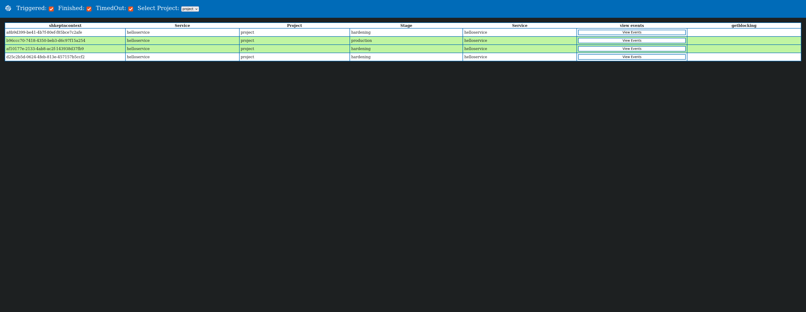
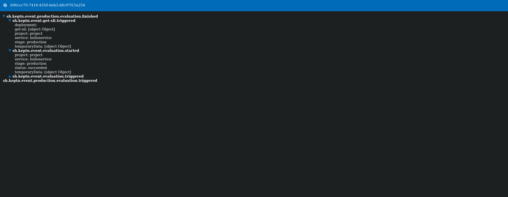
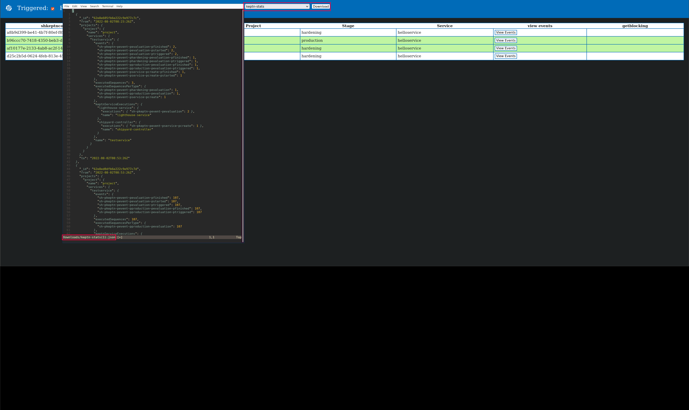

# Keptn Debug-UI

The Debug-UI was built to debug keptn.

**Features:**
 - See all sequences of a project 
 - Get all the events of a specific sequence 
 - Get the sequences which are blocking a specific sequence 
 - Export a MongoDB collection

The Debug-UI can be exposed on port 9090 of the shipyard controller by setting 'DEBUGUI_ENABLED' in the deploy/service.yml to "true".
After enabling it, you can portforward port 9090 of the shipyard-controller to your local host: `kubectl -n keptn port-forward service/shipyard-controller 9090:9090`

All the endpoints are documented in a [Swagger-ui](http://localhost:9090/swagger-ui/)

## View the events of specific sequence

By clicking on the View Events button you are able to see a list of all events relevant to that specific sequence.

## Get all blocking sequences 

If a sequence is currently waiting to be executed, the `getblockingsequences` button will show a list of all blocking sequences.

## Downloading a MongoDB collection

This will download the json data from the selected MongoDB collection. This can be then imported into MongoDB-compass for further debugging by opening an empty Database and then clicking on import.

