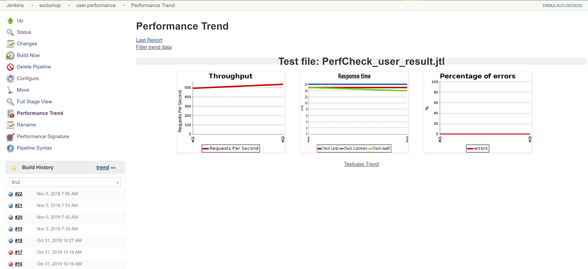
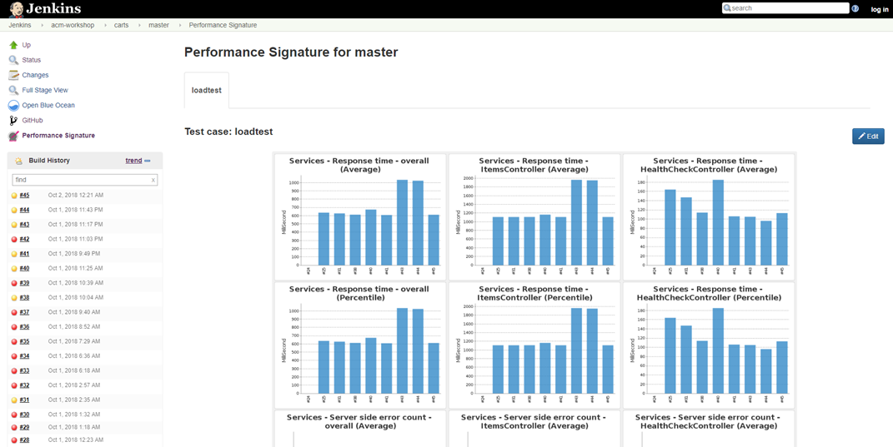
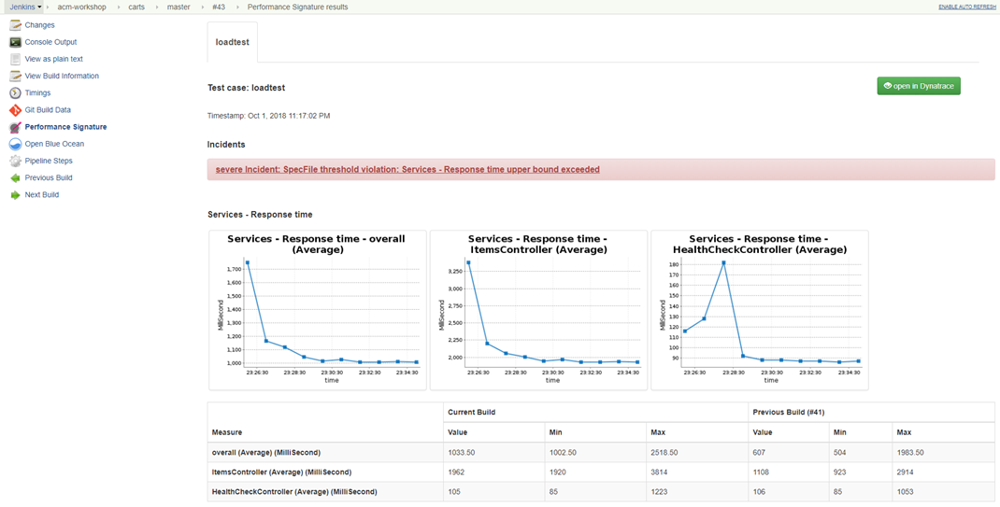
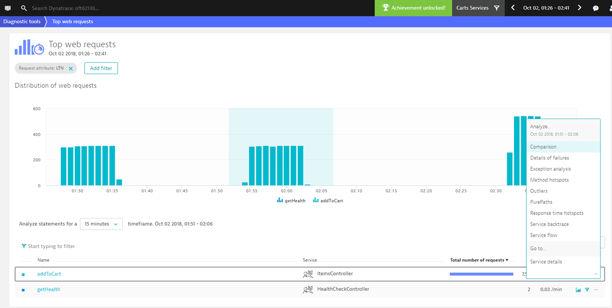
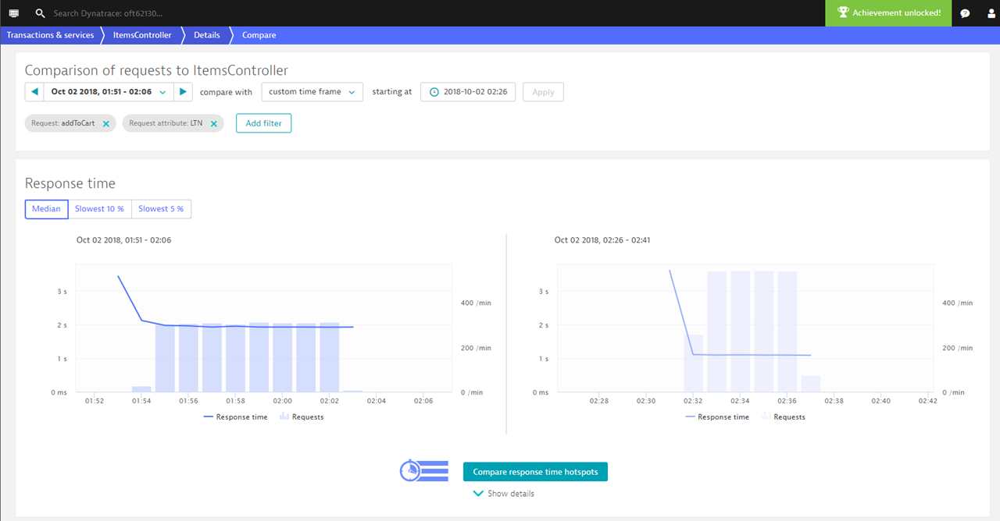
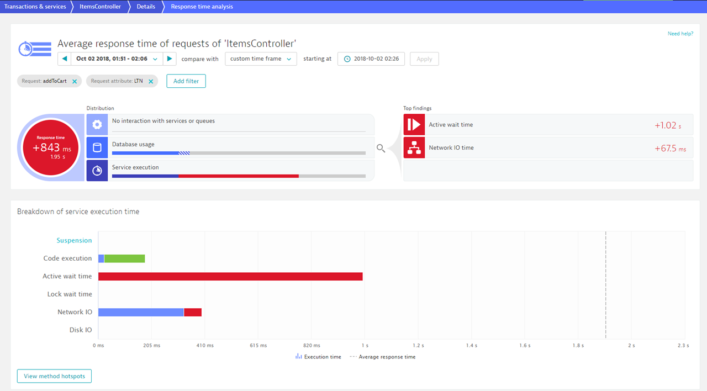
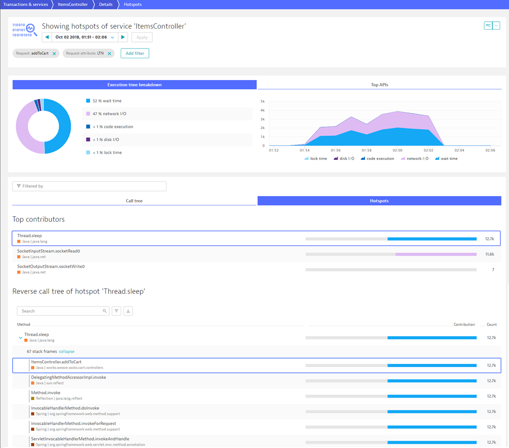

# Performance as a Service

This use case aims on moving from manual sporadic execution and analysis of performance tests to a fully automated on-demand self-service model for developers. This provides early performance feedback and results in better performing software that gets deployed into production.

##### Table of Contents
 * [Step 1: Define request attributes in Dynatrace](#step-one)
 * [Step 2: Run performance test on carts service](#step-two)
 * [Step 3: Compare builds in Dynatrace](#step-three)

## Step 1: Define request attributes in Dynatrace <a id="step-one"></a>

In this step you will set up a rule to capture request attributes in Dynatrace based on web request data. In more detail, the data stored in the request header `x-dynatrace-test` will be extracted to create request attributes that tag and distinguish service traffic. For further information on how to capture request attributes, [please see this page in the Dynatrace documentation.](https://www.dynatrace.com/support/help/monitor/transactions-and-services/request-attributes/how-do-i-capture-request-attributes-based-on-web-request-data/)

1. Create request attribute for Load Test Name (LTN)
    1. Go to **Settings**, **Server-side monitoring**, and click on **Request attributes**.
    1. Click the **Create new request attribute** button.
    1. Provide a unique *Request attribute name*: `LTN`.
    1. Click on **Add new data source**.
    1. Select the *Request attribute source*: `HTTP request header`.
    1. Specify the *Parameter name*: `x-dynatrace-test`.
    1. Open *Optionally restrict or process the captured parameter(s) further*
    1. At *Preprocess by extracting substring* set: `between` > `LTN=` > `;`
    1. Finally, click **Save**, click **Save**.

    Screenshot shows this rule definition.
    

2. Create request attribute for Load Script Name (LSN)
    1. Go to **Settings**, **Server-side monitoring**, and click on **Request attributes**.
    1. Click the **Create new request attribute** button.
    1. Provide a unique *Request attribute name*: `LSN`.
    1. Click on **Add new data source**.
    1. Select the *Request attribute source*: `HTTP request header`.
    1. Specify the *Parameter name*: `x-dynatrace-test`.
    1. Open *Optionally restrict or process the captured parameter(s) further*
    1. At *Preprocess by extracting substring* set: `between` > `LSN=` > `;`
    1. Finally, click **Save**, click **Save**.

3.  Create request attribute for Test Script Name (TSN)
    1. Go to **Settings**, **Server-side monitoring**, and click on **Request attributes**.
    1. Click the **Create new request attribute** button.
    1. Provide a unique *Request attribute name*: `TSN`.
    1. Click on **Add new data source**.
    1. Select the *Request attribute source*: `HTTP request header`.
    1. Specify the *Parameter name*: `x-dynatrace-test`.
    1. Open *Optionally restrict or process the captured parameter(s) further*
    1. At *Preprocess by extracting substring* set: `between` > `TSN=` > `;`
    1. Finally, click **Save**, click **Save**.

## Step 2: Run performance test on carts service <a id="step-two"></a>

In this step you trigger a performance test for (1) the current implementation of carts and (2) a new version of the carts service. The new version of carts intentionally contains a slow down of the service, which will be detected by the performance validation.

1. Run performance test on current implementation
    1. Go to  **Jenkins** and click on **sockshop** folder.
    1. Click on **carts.performance** and select the **master** branch.  
    1. Click on **Build Now** to trigger the performance pipeline.

1. Introduce a slowdown in the carts service
    1. In the directory of `keptn\repositories\carts\`, open the file: `carts\src\main\resources\application.properties`.
    1. Change the value of `delayInMillis` from `0` to `1000`.
    1. Commit/Push the changes to your GitHub Repository *carts*.

    ```console
    $ git add .
    $ git commit -m "Property changed"
    $ git push
    ```

1. Build this new version
    1. Go to your **Jenkins** and click on **sockshop** folder.
    1. Click on **carts** and select the **master** branch.
    1. Click on **Build Now** to trigger the performance pipeline.
    1. Wait until the pipeline shows: *Success*.

1. Run performance test on new version
    1. Go to **Jenkins** and click on **sockshop** folder.
    1. Click on **carts.performance** and select the **master** branch.  
    1. Click on **Build Now** to trigger the performance pipeline.

1. Explore results in Jenkins
    1. After a successful pipeline execution, click on **Performance Trend**. 
    This opens a trend analysis of the JMeter test results. In more details, it shows a chart for the throughput, response time, and percentage of errors as shown below.
    

    2. Click on **Performance Signature**.
    There you get an overview of the last builds similar to the screenshot below. 
    

    3. Click on the **Build No** of one particular build and click on **Performance Signature**.
    This opens a detailed view about the performance validation of the selected build. 
    

## Step 3: Compare builds in Dynatrace <a id="step-three"></a>

In this step you will leverage Dynatrace to identify the difference between two performance tests. Literally, a couple of clicks can tell you the reason why one build was slower compared to another one. 

1. Open Dynatrace from Jenkins Pipeline
    1. In the Performance Signature for a selected build, click on **open in Dynatrace**. (This opens the correct timeframe.)
    1. Go to **Diagnostic tools** and click on **Top web requests**.
    1. (optional) Filter on a Management Zone. 

1. Narrow down the requests based on request attributes
    1. Click on **Add filter**.
    1. Create filter for: `Request attribute` > `LTN`.
    1. Click on **Apply**.

1. Open comparison view
    1. Select the timeframe of a *good build*.
    1. Click on **...** and select **Comparison** as shown below:
    

1. Compare response time hotspots
    1. Select the timeframe of the *bad build* by selecting *compare with*: `custom time frame`
    1. Click on **Compare response time hotspots**.
    
    1. There you can see that the *Active wait time* increased.
    
    1. Click on **View method hotspots** to identify the root cause.
    

---

:arrow_forward: [Use Case: Production Deployments](../production-deployments)

:arrow_up_small: [Back to keptn](../)