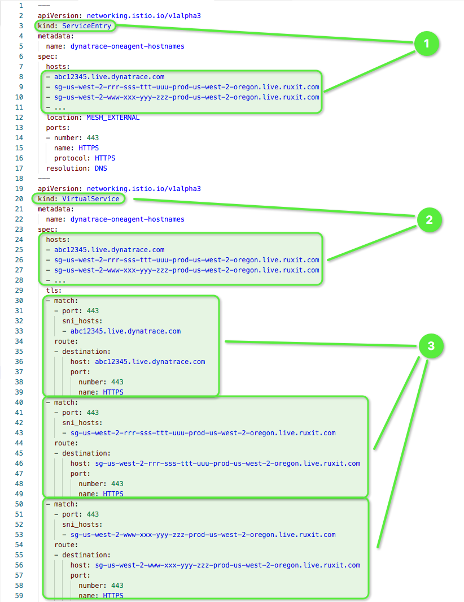
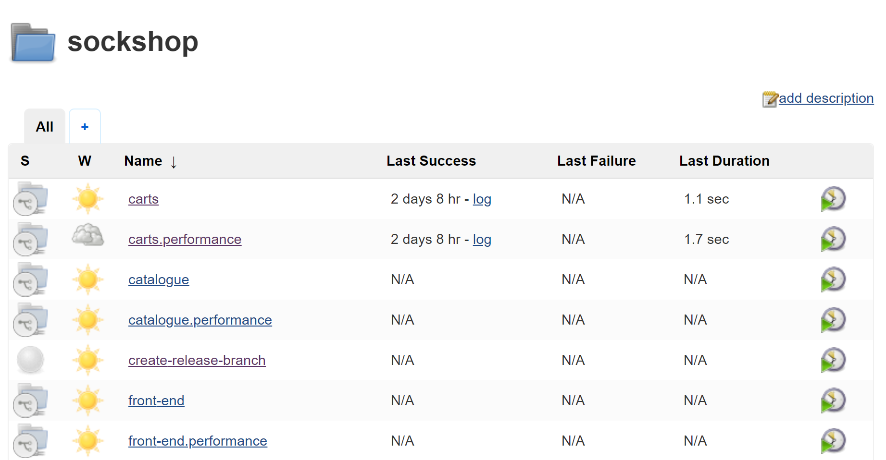
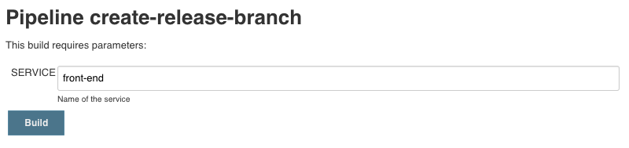

# Production Deployments

This session gives an overview of production deployments, deployment strategies, and showcases those using Istio on Kubernetes to canary-deploy a new front-end version.

##### Table of Contents
 * [Step 0: Verify Istio installation](#step-zero)
 * [Step 1: Configure Istio components](#step-one)
 * [Step 2: Deploy to production](#step-two)
 * [Step 3: Create front-end v2](#step-three)

## Step 0: Verify Istio installation

1. To verify the installation of Istio, execute the `kubectl get services -n istio-system` command:

    ```console
    $ kubectl get services -n istio-system
    NAME                     TYPE           CLUSTER-IP      EXTERNAL-IP     PORT(S)                                          AGE
    grafana                  ClusterIP      10.23.248.137   <none>          3000/TCP                                         10h
    istio-citadel            ClusterIP      10.23.245.163   <none>          8060/TCP,9093/TCP                                10h
    istio-egressgateway      ClusterIP      10.23.250.121   <none>          80/TCP,443/TCP                                   10h
    istio-galley             ClusterIP      10.23.246.195   <none>          443/TCP,9093/TCP                                 10h
    istio-ingressgateway     LoadBalancer   10.23.245.251   **.184.232.**   80:31380/TCP,443:31390/TCP,31400:31400/TCP,...   10h
    istio-pilot              ClusterIP      10.23.242.171   <none>          15010/TCP,15011/TCP,8080/TCP,9093/TCP            10h
    istio-policy             ClusterIP      10.23.245.9     <none>          9091/TCP,15004/TCP,9093/TCP                      10h
    istio-sidecar-injector   ClusterIP      10.23.255.240   <none>          443/TCP                                          10h
    istio-telemetry          ClusterIP      10.23.244.185   <none>          9091/TCP,15004/TCP,9093/TCP,42422/TCP            10h
    jaeger-agent             ClusterIP      None            <none>          5775/UDP,6831/UDP,6832/UDP                       10h
    jaeger-collector         ClusterIP      10.23.251.120   <none>          14267/TCP,14268/TCP                              10h
    jaeger-query             ClusterIP      10.23.250.222   <none>          16686/TCP                                        10h
    prometheus               ClusterIP      10.23.241.134   <none>          9090/TCP                                         10h
    servicegraph             ClusterIP      10.23.249.100   <none>          8088/TCP                                         10h
    tracing                  ClusterIP      10.23.250.199   <none>          80/TCP                                           10h
    zipkin                   ClusterIP      10.23.250.90    <none>          9411/TCP                                         10h

    ```

1. Ensure that the label `istio-injection` has only been applied to the production namespace.

    ```console
    $ kubectl get namespace -L istio-injection
    NAME           STATUS    AGE       ISTIO-INJECTION
    cicd           Active    10d
    default        Active    16d
    dev            Active    10d
    dynatrace      Active    3d
    istio-system   Active    9d        disabled
    kube-public    Active    16d
    kube-system    Active    16d
    production     Active    9d        enabled
    staging        Active    10d
    ```

## Step 1: Configure Istio components * In progress *

In this step, you enable Istio's automatic sidecar injection for production namespace, create and configure mandatory Istio components, and allow mesh external traffic to leave the service mesh.

1. Run the `kubectl get svc` command to get the **EXTERNAL-IP** and **PORT** of your `Gateway`.

    ```console
    $ kubectl get svc istio-ingressgateway -n istio-system
    NAME                   TYPE           CLUSTER-IP       EXTERNAL-IP     PORT(S)                                      AGE
    istio-ingressgateway   LoadBalancer   172.21.109.129   1xx.2xx.10.12x  80:31380/TCP,443:31390/TCP,31400:31400/TCP   17h
    ```

1. We'll define `ServiceEntry`s that add entries to Istio's internal service registry and allow for connection to services that are external to the service mesh, e.g. mesh-external hosted databases for the `carts` and `orders` service.

    ```console
    (bastion)$ kubectl apply -f repositories/k8s-deploy-production/istio/service_entries_sockshop.yml
    ```

1. Last but not least, we need to configure `ServiceEntry`s for the Dynatrace OneAgent, so the language specific components that run inside the pods can communicate with the Dynatrace servers. To do that, at first make a GET call to the REST endpoint of your Dynatrace environment. Replace the _environmentId_ with your environment ID and the _paas-token_ with the PaaS token you've created earlier during the Monitoring-as-a-Service session.

    ```console
    $ curl https://{environmentID}.live.dynatrace.com/api/v1/deployment/installer/agent/connectioninfo?Api-Token={paas-token}
    ```

    The output you get will loke something like this. The list of `communcationEndpoints` is what we need in the next step.

    ```
    {
        "tenantUUID": "abc12345", (your environment ID)
        "tenantToken": "ABCDEF1234567890",
        "communicationEndpoints": [
            "https://sg-us-west-2-rrr-sss-ttt-uuu-prod-us-west-2-oregon.live.ruxit.com/communication",
            "https://sg-us-west-2-www-xxx-yyy-zzz-prod-us-west-2-oregon.live.ruxit.com/communication",
            ...
        ]
    }
    ```

    In the `k8s-deploy-production` repository, open the file `istio/service_entry_oneagent.yml` and edit the contents so that all `communicationEndpoints` from the previous are listed in that file. Make sure that you 
    * enter all `communicationEndpoints` in the `ServiceEntry` :one:, 
    * enter all `communicationEndpoints` in the `VirtualService` :two:,
    * make sure that a `tls-match` entry exists for each `communicationEndpoint` :three:

    

    After editing the file, apply the configuration.

    ```
    (bastion)$ pwd
    ~/repositories/k8s-deploy-production
    (bastion)$ kubectl apply -f istio/service_entry_oneagent.yml
    ```

## Step 2: Deploy to production

In this step, you will promote all components that are currently in the `staging` namespace to the production namespace.

1. Trigger the `k8s-deploy-production` pipeline in your Jenkins instance (see :one:).

    

    This pipeline reads the current versions of all artefacts in the `staging` namespace and deploys those artefacts in the exact same version to the `production` namespace. Instead of pushing individual microservices to production, we chose the approach of defining a release bracket, that holds versions of microservices that work together well.

    <!-- Naturally, we dispatch a deployment event to all affected services. This might not work for the first deployment, because the service might not exist as a Dynatrace entity when dispatching the event, but it will work for all consecutive calls. -->

## Step 3. Create front-end v2

In this step, you create an improved version of the front-end service. You will change the color of the header of the application to be able to see the effect of traffic routing between two different artefact versions.

1. Edit the file `public/topbar.html` in the master branch of the `front-end` repository and change the following lines as seen in the screenshot.

    

1. Save the changes to that file.

1. Now it's time to commit your changes. First locally, and thne pushing it to the remote repository.

    ```console
    $ git add .
    $ git commit -m "New more colorful version of front-end service"
    $ git push
    ```

1. You need the new version of the `front-end` service in the `staging` namespace, before you can start with a blue-green or canary deployment. Therefore, create a new release branch in the `front-end` repository using our Jenkins pipeline:

    1. Go to **Jenkins** and **sockshop**.
    1. Click on **create-release-branch** pipeline and **Schedule a build with parameters**.
    1. For the parameter **SERVICE**, enter the name of the service you want to create a release for **front-end**

        The pipeline does the following:
        1. Reads the current version of the microservice.
        1. Creates a release branch with the name release/**version**.
        1. Increments the current version by 1. 
        1. Commits/Pushes the new version to the Git repository.

        
        

1. After the **create-release-branch** pipeline has finished, trigger the build pipeline for the `front-end` service and and wait until the new artefacts is deployed to the `staging` namespace.

1. You can now see your changes in the `front-end` service that is deployed in `staging`. Get the public IP of the `front-end` load balancer in `staging` by listing all services in that namespace.

    ```console
    $ kubectl -n staging get services
    NAME           TYPE            CLUSTER-IP       EXTERNAL-IP     PORT(S)
    carts          ClusterIP       10.11.250.175    <none>          80/TCP
    catalogue      ClusterIP       10.11.254.135    <none>          80/TCP
    front-end      LoadBalancer    10.11.249.245    1*.2*.3*.4*     8080:31481/TCP
    orders         ClusterIP       10.11.251.11     <none>          80/TCP
    payment        ClusterIP       10.11.248.211    <none>          80/TCP
    queue-master   ClusterIP       10.11.242.139    <none>          80/TCP
    rabbitmq       ClusterIP       10.11.255.201    <none>          5672/TCP,9090/TCP
    shipping       ClusterIP       10.11.244.162    <none>          80/TCP
    user           ClusterIP       10.11.245.147    <none>          80/TCP
    user-db-svc    ClusterIP       10.11.243.25     <none>          27017/TCP
    ```

    Enter the public IP (e.g., 1*.2*.3*.4*) in your browser and you should see the visual improvements you did.

    