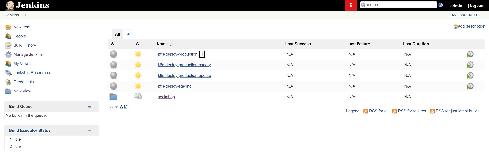
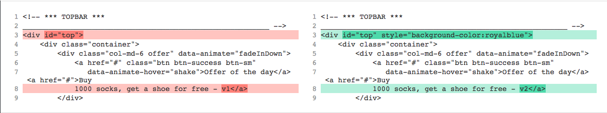
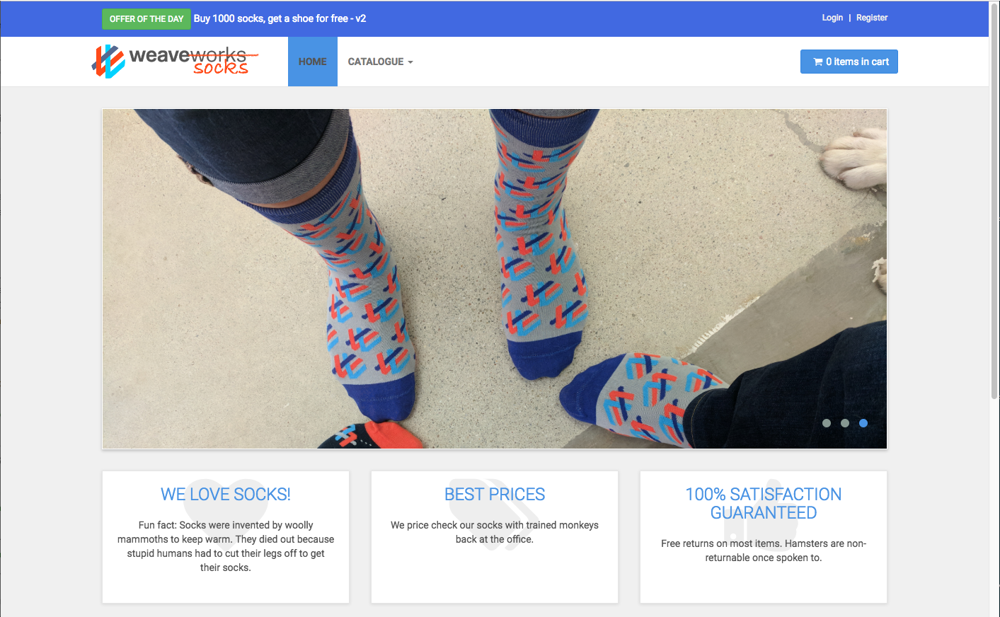
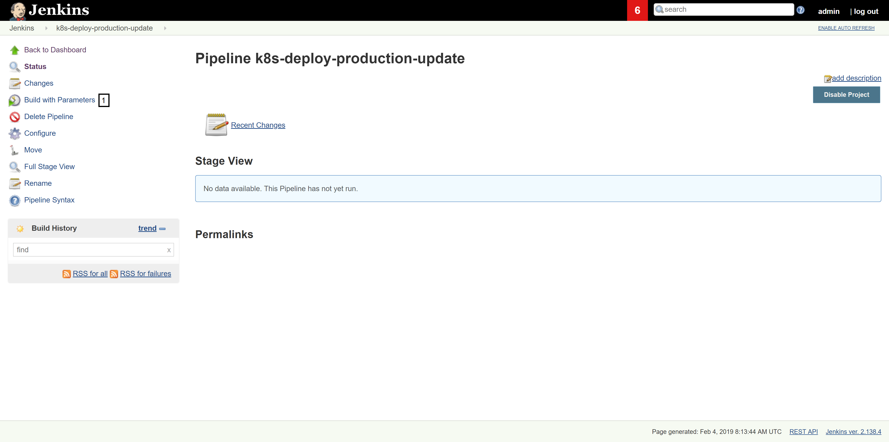
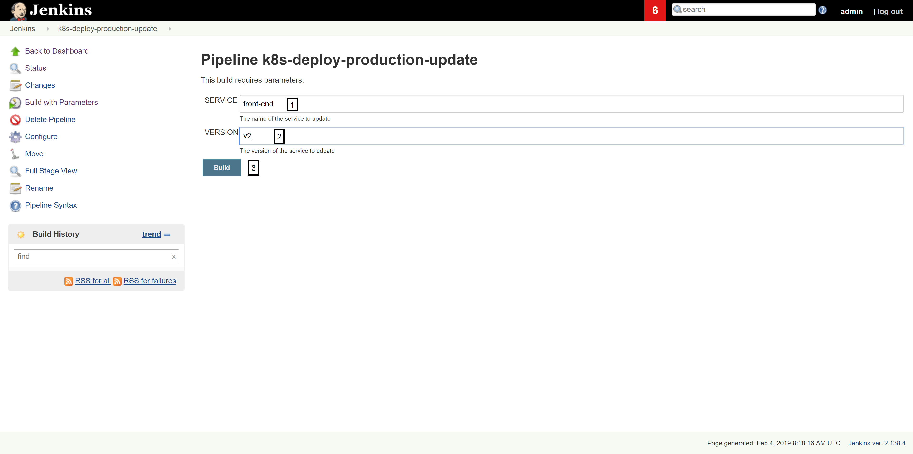
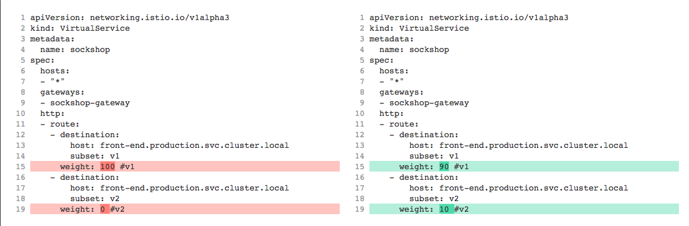

# Production Deployments

This use case gives an overview of production deployments, deployment strategies, and showcases those using Istio on Kubernetes to canary-deploy a new front-end version.

## About this use case

##### Table of Contents
 * [Step 0: Verify Istio installation and deploy sockshop to production](#step-zero)
 * [Step 1: Access ingress gateway](#step-one)
 * [Step 2: Create front-end v2](#step-two)
 * [Step 3: Deploy front-end v2 to production](#step-three)
 * [Step 4: Istio traffic routing](#step-four)
 * [Step 5: Cleanup use case](#step-five)

## Step 0: Verify Istio installation and deploy sockshop to production <a id="step-zero"></a>

1. To verify the installation of Istio, execute the `kubectl get services -n istio-system` command:

    ```console
    $ kubectl get services -n istio-system
    NAME                     TYPE           CLUSTER-IP      EXTERNAL-IP     PORT(S)                                          AGE
    grafana                  ClusterIP      10.23.248.137   <none>          3000/TCP                                         10h
    istio-citadel            ClusterIP      10.23.245.163   <none>          8060/TCP,9093/TCP                                10h
    istio-egressgateway      ClusterIP      10.23.250.121   <none>          80/TCP,443/TCP                                   10h
    istio-galley             ClusterIP      10.23.246.195   <none>          443/TCP,9093/TCP                                 10h
    istio-ingressgateway     LoadBalancer   10.23.245.251   **.184.232.**   80:31380/TCP,443:31390/TCP,31400:31400/TCP,...   10h
    istio-pilot              ClusterIP      10.23.242.171   <none>          15010/TCP,15011/TCP,8080/TCP,9093/TCP            10h
    istio-policy             ClusterIP      10.23.245.9     <none>          9091/TCP,15004/TCP,9093/TCP                      10h
    istio-sidecar-injector   ClusterIP      10.23.255.240   <none>          443/TCP                                          10h
    istio-telemetry          ClusterIP      10.23.244.185   <none>          9091/TCP,15004/TCP,9093/TCP,42422/TCP            10h
    ```

1. Ensure that the label `istio-injection` has only been applied to the production namespace by executing the `kubectl get namespace -L istio-injection` command:

    ```console
    $ kubectl get namespace -L istio-injection
    NAME           STATUS    AGE       ISTIO-INJECTION
    cicd           Active    10h
    default        Active    10h
    dev            Active    10h
    dynatrace      Active    10h
    istio-system   Active    10h        disabled
    kube-public    Active    10h
    kube-system    Active    10h
    production     Active    10h        enabled
    staging        Active    10h
    ```

1. Trigger the `k8s-deploy-production` pipeline in your Jenkins instance (see :one:). This promotes all components that are currently in the *staging* namespace to the *production* namespace.

    

    This pipeline reads the current versions of all artefacts in the *staging* namespace and deploys those artefacts in the exact same version to the *production* namespace. Instead of pushing individual microservices to production, we chose the approach of defining a release bracket, which holds versions of microservices that work together well.

    <!-- Naturally, we dispatch a deployment event to all affected services. This might not work for the first deployment, because the service might not exist as a Dynatrace entity when dispatching the event, but it will work for all consecutive calls. -->

## Step 1: Access ingress gateway <a id="step-one"></a>

1. Run the `kubectl get svc istio-ingressgateway -n istio-system` command to get the *EXTERNAL-IP* of your *Gateway*.

    ```console
    $ kubectl get svc istio-ingressgateway -n istio-system
    NAME                   TYPE           CLUSTER-IP       EXTERNAL-IP     PORT(S)                                      AGE
    istio-ingressgateway   LoadBalancer   172.21.109.129   1**.2**.1**.1**  80:31380/TCP,443:31390/TCP,31400:31400/TCP   17h
    ```

## Step 2. Create front-end v2 <a id="step-two"></a>

In this step, you create an *improved* version of the front-end service. You will change the color of the application header to see the effect of traffic routing between two different artefact versions.

1. Edit the file `public/topbar.html` in the master branch of the `~/keptn/repositories/front-end` repository and change the following lines as depicted in the screenshot:

    

1. Save the changes to that file.

1. Now it's time to commit your changes; first locally, and then push it to the remote repository.

    ```console
    $ git add .
    $ git commit -m "New more colorful version of front-end service"
    $ git push
    ```

1. You need the new version of the `front-end` service in the *staging* namespace, before you can start with a blue-green or canary deployment. Therefore, create a new release branch in the `front-end` repository using our Jenkins pipeline:

    1. Go to **Jenkins** and **sockshop**.
    1. Click on **create-release-branch** pipeline and **Schedule a build with parameters**.
    1. For the parameter **SERVICE**, enter the name of the service you want to create a release for. In this case: **front-end**

        The pipeline does the following:
        1. Reads the current version of the microservice.
        1. Creates a release branch with the name release/**version**.
        1. Increments the current version by 1. 
        1. Commits/Pushes the new version to the Git repository.

        

1. After the **create-release-branch** pipeline has finished, trigger the build pipeline for the `front-end` service and wait until the new artefacts is deployed to the *staging* namespace.
    - Wait until the release/**version** build has finished.

1. To see your changes in the `front-end` service that is deployed in *staging*, get the *EXTERNAL-IP* of the `front-end` load balancer in *staging* by listing all services in that namespace.

    ```console
    $ kubectl -n staging get services
    NAME           TYPE            CLUSTER-IP       EXTERNAL-IP         PORT(S)
    carts          ClusterIP       10.11.250.175    <none>              80/TCP
    catalogue      ClusterIP       10.11.254.135    <none>              80/TCP
    front-end      LoadBalancer    10.11.249.245    1**.2**.3**.4**     8080:31481/TCP
    orders         ClusterIP       10.11.251.11     <none>              80/TCP
    payment        ClusterIP       10.11.248.211    <none>              80/TCP
    queue-master   ClusterIP       10.11.242.139    <none>              80/TCP
    rabbitmq       ClusterIP       10.11.255.201    <none>              5672/TCP,9090/TCP
    shipping       ClusterIP       10.11.244.162    <none>              80/TCP
    user           ClusterIP       10.11.245.147    <none>              80/TCP
    user-db-svc    ClusterIP       10.11.243.25     <none>              27017/TCP
    ```

    Enter the public IP (e.g., 1**.2**.3**.4**:8080) in your browser and you see the visual improvements you did.

    

## Step 3. Deploy front-end v2 to production <a id="step-three"></a>

In this step, you will promote the new version of the `front-end` service to production.

1. In your Jenkins instance, trigger the parameterized pipeline `k8s-deploy-production.update` (see :one:).

    

2. Enter `front-end` as service name and `v2` as new version when asked for parameters to that pipeline.

    

    This pipeline reads the version of the passed service in the *staging* namespace and deploys the artefact in that version to the *production* namespace in a deployment with the passed version number. After running that pipeline, two deployments of `front-end` (one with *v1* and one with *v2*) are available.

    ```console
    $ kubectl -n production get deployment
    NAME           DESIRED   CURRENT   UP-TO-DATE   AVAILABLE   AGE
    ...
    front-end-v1   1         1         1            1           10h
    front-end-v2   1         1         1            1           32s
    ...
    ```

    At this stage, the **VirtualService** for sockshop is configured to use *v1* initially. So, the application is not affected at all by the deployment of a new version in the *production* namespace. You can check the details of the deployments to see that each deployment uses a different artefact version, e.g. `0.5.0` and `0.6.0`, in the example below:

    ```console
    $ kubectl -n production describe deployment front-end-v1
    ...
    Pod Template:
    Labels:  app=front-end
             version=v1
    Containers:
    front-end:
        Image:      10.11.249.13:5000/library/sockshop/front-end-0.5.0
        Port:       8080/TCP
        Host Port:  0/TCP
    ...
    ```

    ```console
    $ kubectl -n production describe deployment front-end-v2
    ...
    Pod Template:
    Labels:  app=front-end
             version=v2
    Containers:
    front-end:
        Image:      10.11.249.13:5000/library/sockshop/front-end-0.6.0
        Port:       8080/TCP
        Host Port:  0/TCP
    ...
    ```

## Step 4. Istio traffic routing <a id="step-four"></a>

In this step, you will configure traffic routing in Istio to redirect traffic based on different criteria to *v2* of the `front-end` service. It addresses the tasks to redirect traffic using weight rules, redirect only logged in users, and to redirect only Chrome users to v2.

1. Right now, traffic to `front-end` is routed to *v1* due to the configuration of the **VirtualService**. The `subset: v1` entry in the configuration takes care of that.

    ```yaml
    apiVersion: networking.istio.io/v1alpha3
    kind: VirtualService
    metadata:
    name: sockshop
    spec:
    hosts:
    - "*"
    gateways:
    - sockshop-gateway
    http:
    - route:
        - destination:
            host: front-end.production.svc.cluster.local
            subset: v1
    ```

1. To see if the new version works properly, 10% of the traffic can be redirected to that version. Therefore, it is necessary to modify the `virtual-service-canary.yml` in the `~/keptn/repositories/k8s-deploy-production/istio` repository and to apply it.

    ```console
    $ pwd
    ~/repositories/k8s-deploy-production/istio
    $ vi virtual-service-canary.yml
    ...
    ```

    Edit the file like this:

    **!Note! YOU MUST NOT DELETE THE COMMENTS #v1 AND #v2 - THE COMMENTS ARE NEEDED LATER ON**

    

    This configuration redirects 10% of all traffic hitting the sockshop **VirtualService** to version 2. 

1. Apply the changes by executing the command `kubectl apply -f virtual_service_canary.yml`

    ```console
    $ kubectl apply -f virtual_service_canary.yml
    virtualservice.networking.istio.io/sockshop configured
    ```

1. To verify the configuration change, open the ingress gateway and refresh the page a couple of times. You should notice that about every tenth hit redirects you to the new version (*v2*) showing a blue header.

#### Redirect only logged in users

1. You can decide traffic routing also based on information that is included in the HTTP header. For example, you can present *v2* only to users that are logged in. See the following configuration that enables that:

    ```yaml
    apiVersion: networking.istio.io/v1alpha3
    kind: VirtualService
    metadata:
    name: sockshop
    spec:
    hosts:
    - "*"
    gateways:
    - sockshop-gateway
    http:
    - match:
        - headers:
            cookie:
            regex: ".*logged_in.*"
        route:
        - destination:
            host: front-end.production.svc.cluster.local
            subset: v2
    - route:
        - destination:
            host: front-end.production.svc.cluster.local
            subset: v1
    ```

    Istio checks if the cookie field of the HTTP header contains the string `logged_in` using regular expressions. This, of course, depends on the implementation of your web application and is not universally applicable.

1. Apply the changes by executing the command `kubectl apply -f virtual_service_v2_for_users.yml`

    ```console
    $ kubectl apply -f virtual_service_v2_for_users.yml
    virtualservice.networking.istio.io/sockshop configured
    ```

1. If you login using either a new registered user, or a user that you've created before, you see version 2. After logging out, you see verison 1 again.

#### Redirect only Chrome users

1. Another option is to redirect traffic based on the used browser. See the following configuration that enables that:

    ```yaml
    apiVersion: networking.istio.io/v1alpha3
    kind: VirtualService
    metadata:
    name: sockshop
    spec:
    hosts:
    - "*"
    gateways:
    - sockshop-gateway
    http:
    - match:
        - headers:
            user-agent:
            regex: ".*Chrome.*"
        route:
        - destination:
            host: front-end.production.svc.cluster.local
            subset: v2
    - route:
        - destination:
            host: front-end.production.svc.cluster.local
            subset: v1
    ```

1. Apply the changes by executing the command `kubectl apply -f virtual_service_v2_for_chrome.yml`

    ```console
    $ kubectl apply -f virtual_service_v2_for_chrome.yml
    virtualservice.networking.istio.io/sockshop configured
    ```

1. If you open sockshop using Chrome you see version 2, with any other browser version 1 is displayed.

## Step 5. Cleanup use case<a id="step-five"></a>

1. Apply the configuration of the **VirtualService** to use v1 only.

    ```console
    $ cd ~/keptn/repositories/k8s-deploy-production/istio
    $ kubectl apply -f virtual_service.yml
    virtualservice.networking.istio.io/sockshop configured
    ```

## Understanding what happened

In this use case, you 
