# Runbook Automation and Self-healing

This use case gives an overview of how to leverage the power of runbook automation to build self-healing applications. Therefore, you will use Ansible Tower as the tool for executing and managing the runbooks.

## Before you begin

optional section

## About this use case

In this use case, 

#### Table of Contents
 * [Step 0: Check prerequisites](#step-zero)
 * [Step 1: Verify installation of Ansible Tower](#step-one)
 * [Step 2: Integration of Ansible Tower runbook in Dynatrace](#step-two)
 * [Step 3: Apply anomaly detection rules](#step-three)
 * [Step 4: Run a promotional campaign](#step-four)

## Step 0: Check prerequisites <a id="step-zero"></a>

1. A personal license for Ansible Tower is needed. In case you don't have a license yet, you can get a free license here: https://www.ansible.com/license

    The personal edition with limited features is sufficient for this use case.

    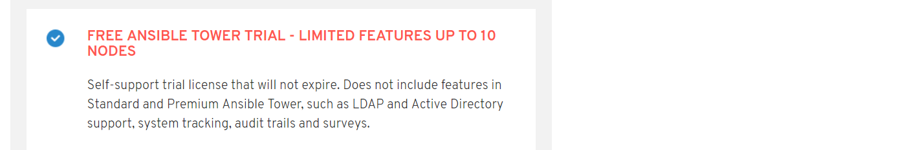


## Step 1: Verify installation of Ansible Tower <a id="step-one"></a>

During the setup of the cluster, Ansible Tower has already been installed and preconfigured for you. 

1. Login to your Ansible Tower instance.

    Receive the public IP from your Ansible Tower:
    ```console
    $ kubectl get services -n tower
    NAME            TYPE           CLUSTER-IP     EXTERNAL-IP     PORT(S)         AGE
    ansible-tower   LoadBalancer   xx.xx.xxx.xx   xx.xxx.xxx.xx   443:30528/TCP   1d
    ```
    
    Copy the `EXTERNAL-IP` into your browser and navigate to https://external-ip 

1. Submit the Ansible Tower license when prompted.
    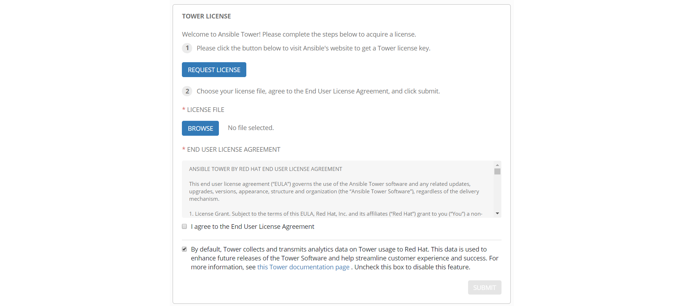

1. Your login is:

    - Username: `admin` 
    - Password: `dynatrace` 

    You should see your initial dashboard after your first login.
    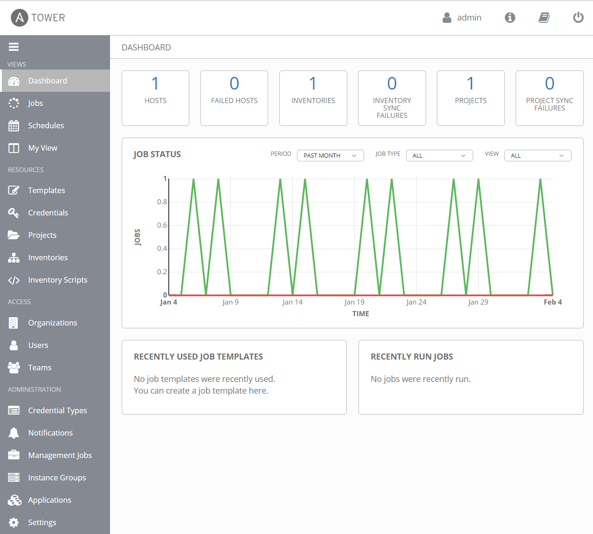


### Verify predefined Templates, Projects and Inventories

When running the install scripts from [this readme](../../README.md) Ansible Tower is already preconfigured for this use case. The needed templates, inventories, and projects are already created and set up. We are going to verify this.

1. **Credentials**

    Click on **Credentials** and verify that the `git-token` passed via the `creds.json` file has been added to your Ansible Tower instance.

1. **Inventories**

    Click on **Inventories** and verify that an inventory with some variables has already been added for you.

1. **Projects**

    Click on **Projects** and verify that a project with name **self-healing** has been added.

1. **Templates**

    Click on **Templates** and verify that several job templates have been added.
    - canary
    - canary-reset
    - remediation
    - start-campaign
    - stop-campaign

    <a id="copy-to-clipboard"></a>
    Please go ahead an open the *remediation* playbook. Copy the URL from your browser to your clipboard, we will need it in a second. 
    

## Step 2: Integration of Ansible Tower runbook in Dynatrace <a id="step-two"></a>

This step integrates the defined *remediation runbook* in Dynatrace in a way that it will be called each time Dynatrace detects a problem. Please note that in an enterprise scenario, you might want to define *Alerting profiles* to be able to control problem notifications in a more fine-grained way when to call a remediation runbook.

1. Setup a problem notification in Dynatrace
    - Navigate to **Settings**, **Integration**, **Problem notification**, **Set up notifications**, and **Ansible Tower** 

    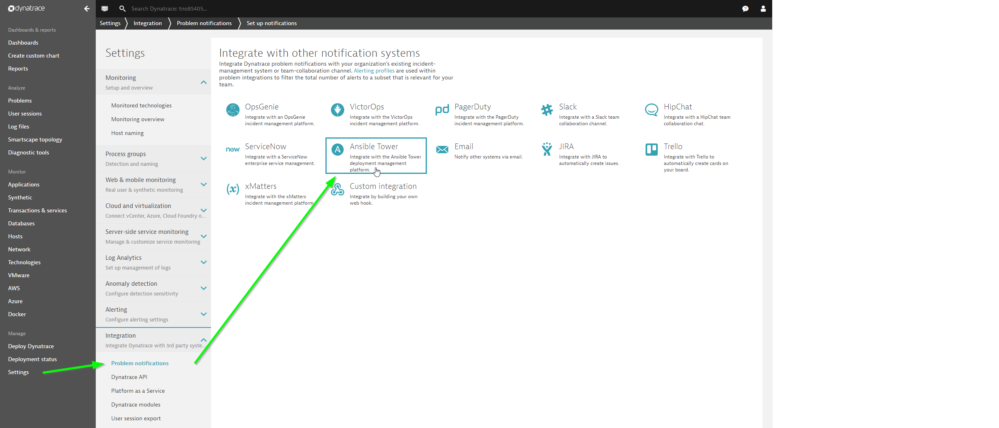

1. Enter your Ansible Tower job template URL and Ansible Tower credentials.
    - Name: e.g., "remediation"
    - Ansible Tower job template URL: copy & paste the Ansible Tower job URL from your Ansible Tower remediation job template, e.g., `https://XX.XXX.XX.XXX/#/templates/job_template/18` (you should have this copied to your clipboard already in the [previous step](#copy-to-clipboard) )
    - Username: your Ansible Tower username `admin`
    - Password: your Ansible Tower password `dynatrace`
    - Click **Send test notification** > a green banner should appear.
    - **Save** the integration

    

1. *Optional:* Navigate back to your Ansible Tower instance and check what happenend when setting up the integration.
    - Navigate to **Jobs** and click on your *X - remediation* job
    - You can see all tasks from the playbook that have been triggered by the integration.

## Step 3: Apply anomaly detection rules <a id="step-three"></a>

Both problem and anomaly detection in Dynatrace leverage AI technology. This means that the AI learns how each and every microservice behaves and baselines them. Therefore, in a demo scenario like we have right now, we have to override the AI engine with user-defined values to allow the creation of problems due to an artificial increase of a failure rate. (Please note if we would have the application running and simulate end-user traffic for a couple of days there would be no need for this step.)

In your Dynatrace tenant, navigate to "Transaction & services" and filter by: *app:carts* and *environment:production* (This assumes that you have done the previous use-cases of keptn)

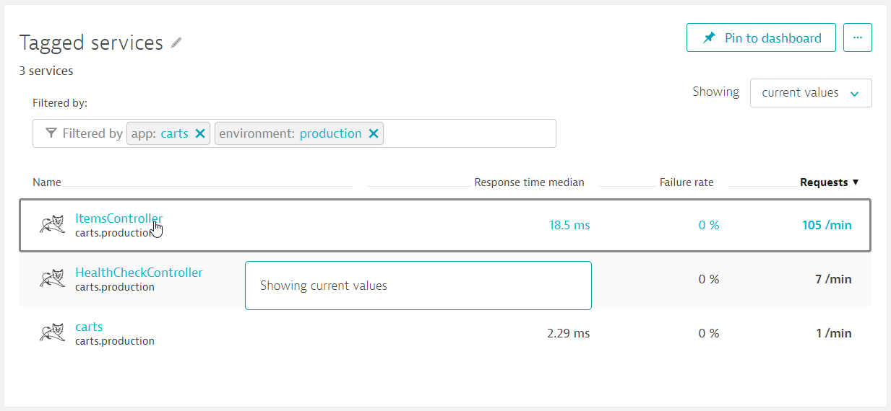

Click on the **ItemsController** and then on the three dots ( <kbd>...</kbd> ) next to the service name. Click on *Edit*. 
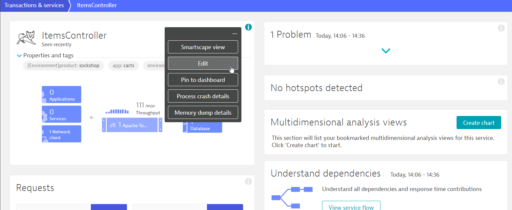

On the next screen, edit the anomaly detection settings as seen in the following screenshot.
- **Globaly anomaly detection** has to be **turned off**
- Detect increases in **failure rate** using **fixed thresholds**
- Alert if **10 %** custom failure rate threshold is exceed during any 5-minute period.
- Sensitivity: **High**

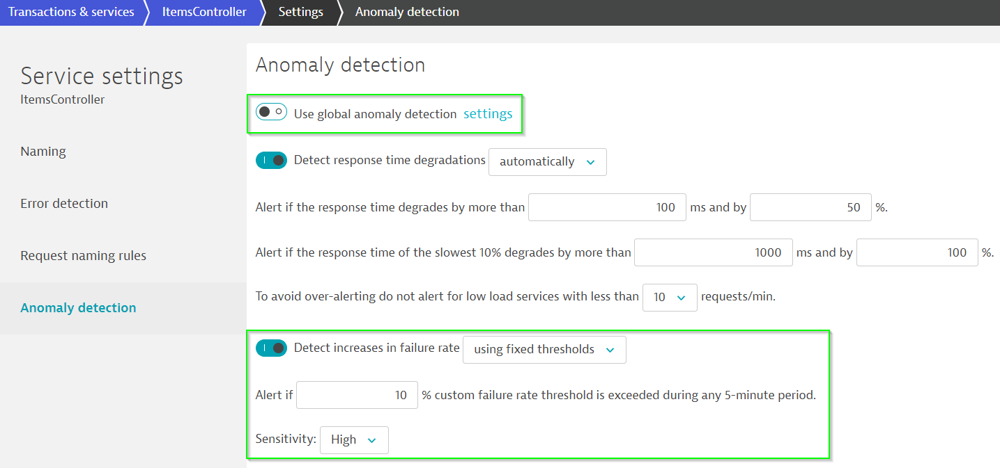


## Step 4: Run a promotional campaign <a id="step-four"></a>

This step runs a promotional campaign in our production environment by applying a change to our configuration of the `carts` service. This service is prepared to allow to add a promotional gift (e.g., Halloween Socks, Christmas Socks, Easter Socks, ...) to a given percentage of user interactions in the `carts` service. 

Therefore, the endpoint `carts/1/items/promotional/` can take a number between 0 and 100 as an input, which corresponds to the percentages of user interactions that will receive the promotional gift, i.e., `carts/1/items/promotional/5` will enable it for 5 %, while `carts/1/items/promotional/100` will enable it for 100 % of user interactions. 

The promotional itself is controlled via Ansible Tower. That means that starting, and eventually stopping the campaign is done by triggering Ansible Tower job templates that in turn start Ansible playbooks.

1. First we want to generate load for the carts service
    - Receive the IP of the carts service by executing the `kubectl get svc -n production` command: 

      ```console
      $ kubectl get svc carts -n production
      NAME    TYPE           CLUSTER-IP      EXTERNAL-IP       PORT(S)        AGE
      carts   LoadBalancer   xx.xx.xxx.xxx   xxx.xxx.xxx.xxx   80:31399/TCP   1d
      ```

    - From inside your `keptn` directory, navigate to the `usecases/runbook-automation-and-self-healing/scripts` directory and start the [add-to-cart](../scripts/) script using the IP of your carts service.

      ```console
      $ cd usecases/runbook-automation-and-self-healing/scripts
      $ ./add-to-cart.sh http://XXX.XXX.XXX.XXX/carts/1/items

      Press [CTRL+C] to stop..

      adding item to cart...
      {"id":"3395a43e-2d88-40de-b95f-e00e1502085b","itemId":"03fef6ac-1896-4ce8-bd69-b798f85c6e0b","quantity":2187,"unitPrice":0.0}
      adding item to cart...
      {"id":"3395a43e-2d88-40de-b95f-e00e1502085b","itemId":"03fef6ac-1896-4ce8-bd69-b798f85c6e0b","quantity":2188,"unitPrice":0.0}
      adding item to cart...
      {"id":"3395a43e-2d88-40de-b95f-e00e1502085b","itemId":"03fef6ac-1896-4ce8-bd69-b798f85c6e0b","quantity":2189,"unitPrice":0.0}
      ...
      ```

1. Run the promotional campain
    - Navigate to **Templates** in your Ansible Tower
    - Click on the "rocket" icon (🚀) next to your *start-campaign* job template
    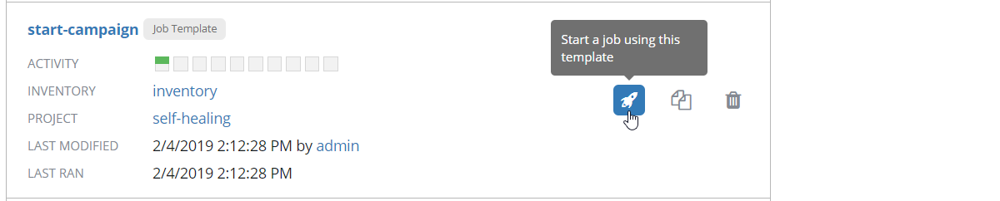
    - Adjust the values accordingly for you promotional campaign:
      - Set the value for `promotion_rate: '30'` to allow for 30 % of the user interactions to receive the promotional gift
      - Do not change the `remediation_action`, this is already configured for you and it is set to the `stop-campaign` job template URL.
    - Click **Next**, then **Launch**

1. To verify the update in the `carts` service in Dynatrace, navigate to the `carts` service in your Dynatrace tenant and see the configuration change that has been applied and attached to the `carts` service in the production environment.
    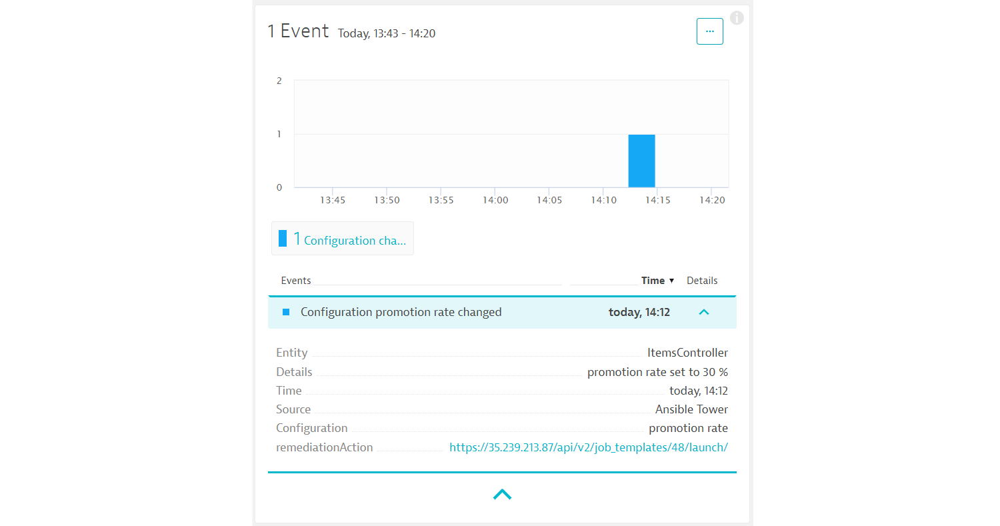

    Please also note that a remediation action has been attached to this configuration change. This means, if Dynatrace detects a problem with this service that is related to this configuratio change, this remediation action could be called to remediate the problem. 

1. Looking at the loadgeneration output in your console, you will notice that about 1/3 of the requests will produce an error.

    ```console
    ...
    {"id":"3395a43e-2d88-40de-b95f-e00e1502085b","itemId":"03fef6ac-1896-4ce8-bd69-b798f85c6e0b","quantity":13916,"unitPrice":0.0}
    adding item to cart...
    {"id":"3395a43e-2d88-40de-b95f-e00e1502085b","itemId":"03fef6ac-1896-4ce8-bd69-b798f85c6e0b","quantity":13917,"unitPrice":0.0}
    adding item to cart...
    {"timestamp":1549290255564,"status":500,"error":"Internal Server Error","exception":"java.lang.Exception","message":"promotion campaign not yet implemented","path":"/carts/1/items"}
    ...
    ```

1. After a couple of minutes, Dynatrace will open a problem ticket for the increase of the failure rate. Since we have setup the problem notification with Ansible Tower, the according *remediation* playbook will be executed once Dynatrace sends out the notification.

    The **open problem ticket** in Dynatrace gives us detailed information on the problem:
    - we see how many users, service calls, and services are impacted (1 service, ItemsController)
    - we see why the problem was created (increase of the failure rate)
    - Dynatrace detected the root cause of the problem
        - failure rate increase due to
        - configuration change
    - we already see two comments on the problem
        - one comment that the remediation playbook has started
        - one comment that the remediation playbook has already finished executing

    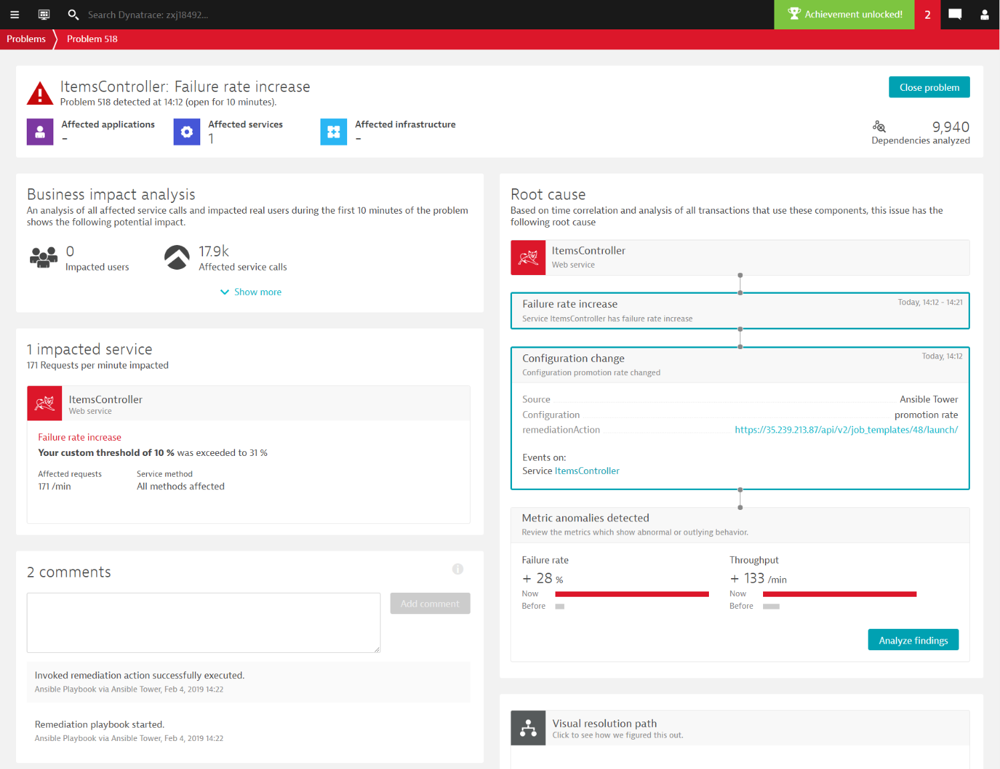

1. To verify executed playbooks in Ansible Tower, navigate to **Jobs** and verify that Ansible Tower has executed two jobs.        
    - The first job `X - remediation` was called since Dynatrace sent out the problem notification to Ansible Tower. 
    - This job was then executing the remediation tasks which include the execution of the remediation action that is defined in the custom configuration event of the impacted entities (the `carts` service). Therefore, you will also see a job called `X - stop-campaign` that was executed.

    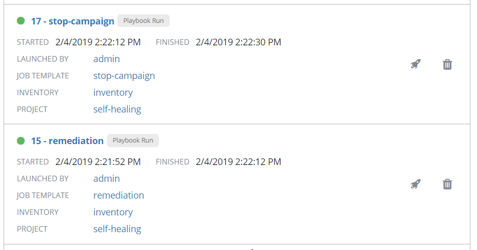


1. The remediation playbook set back the promotion rate to 0 %, which is also send back to Dynatrace.
    - New configuration event that set the promotion rate back to 0 %:
    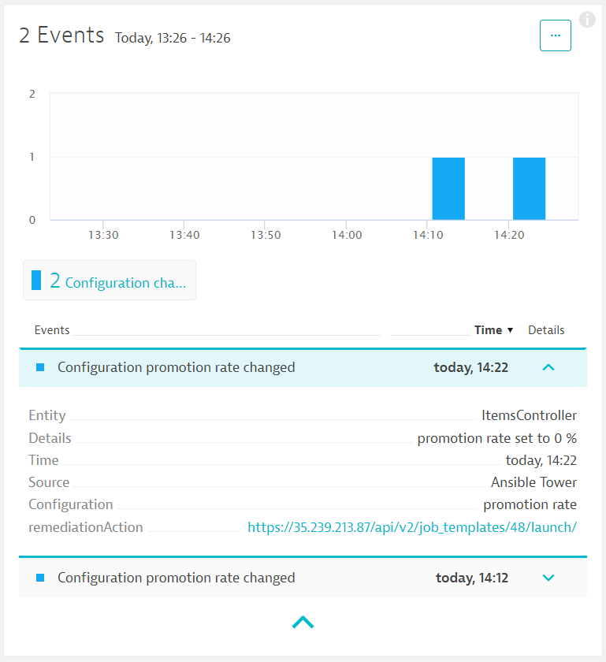

1. Problem is remediated thanks to automating runbook execution by Dynatrace!

## Understanding what happened

In this use case, you 

---

[Use Case: Production deployments](../production-deployments) :arrow_backward: :arrow_forward: [Use Case: Unbreakable delivery pipeline](../unbreakable-delivery-pipeline)

:arrow_up_small: [Back to keptn](../)
