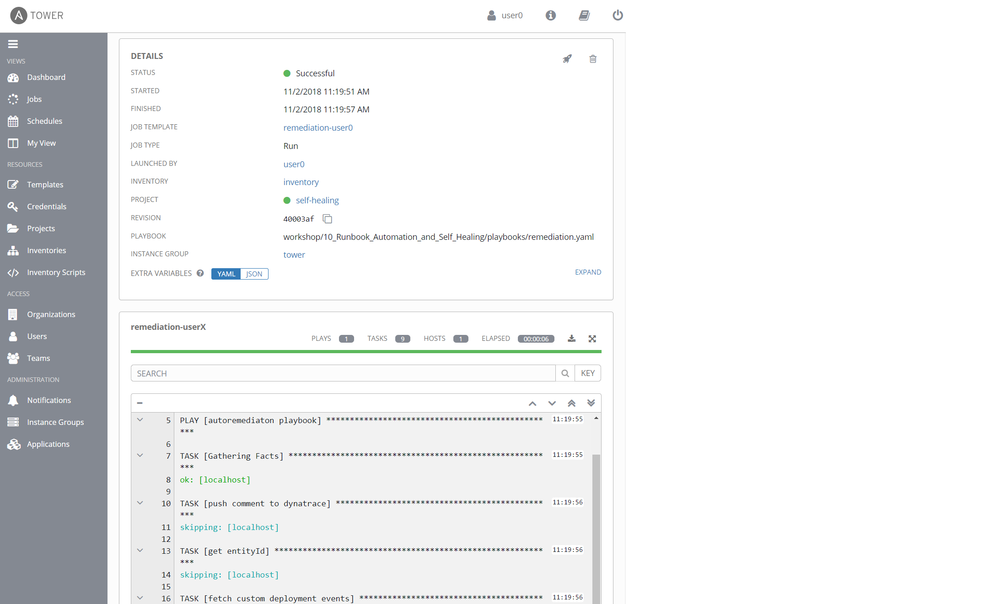
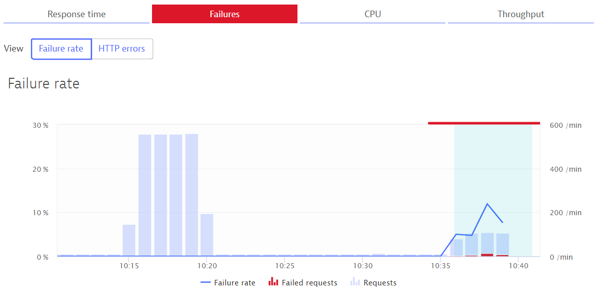
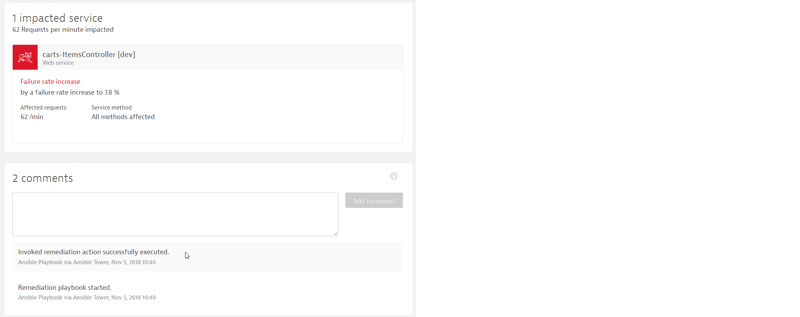

# Runbook Automation and Self-healing

This use case gives an overview of how to leverage the power of runbook automation to build self-healing applications. Therefore, you will use Ansible Tower as the tool for executing and managing the runbooks.

##### Table of Contents
 * [Step 0: Check prerequisites](#step-zero)
 * [Step 1: TBD](#step-one)
 * [Step 2: Integration Ansible Tower runbook in Dynatrace](#step-two)
 * [Step 3: Run a promotional campaign](#step-three)

## Step 0: Check prerequisites <a id="step-zero"></a>

1. You personal license for Ansible Tower is needed. In case you don't have your license yet, you can get a free license here: https://www.ansible.com/license

1. Submit the Ansible Tower license when prompted.
    

## Step 1: TBD <a id="step-one"></a>

## Step 2: Integration Ansible Tower runbook in Dynatrace <a id="step-two"></a>

This step integrates the defined _remediation runbook_ in Dynatrace in a way, that it will be called each time Dynatrace detects a problem. Please note that in a more enterprise scenario, you might want to define _Alerting profiles_ to be able to control in a more fine-grained way when to call a remediation runbook.

1. Setup a **Problem Notification** in Dynatrace
    - Navigate to **Settings**, **Integration**, **Problem notification**, **Ansible Tower** 

    

1. Enter your Ansible Tower job template URL and Ansible Tower credentials.
    - Name: e.g., "remediation playbook"
    - Ansible Tower job template URL: copy & paste the Ansible Tower job URL from your Ansible Tower remediation job template, e.g., `https://XX.XXX.XX.XXX/#/templates/job_template/18`
    - Username: your Ansible Tower username `admin`
    - Password: your Ansible Tower password `dynatrace`
    - Click **Send test notification** > a green banner should appear
    - Save the integration

    

1. Login (or navigate back) to your Ansible Tower instance and check what happenend when setting up the integration.
    - Navigate to **Jobs** and click on your _remediation-user0_ job
    - You can see all tasks from the playbook that have been triggered by the integration.

    

## Step 3: Run a promotional campaign <a id="step-three"></a>

In this lab we want to run our promotional campaign in our production environment by applying a change to our configuration of the `carts` service. This service is prepared to allow to add a promotional gift (e.g., Halloween Socks, Christmas Socks, Easter Socks, ...) to a given percentage of user interactions in the `carts` service. 
Therefore, the endpoint `carts/1/items/promotional/` can take as an input a number between 0 and 100 which corresponds to the percentages of user interactions that will receive the promotional gift. E.g., `carts/1/items/promotional/5` will enable it for 5 %, while `carts/1/items/promotional/100` will enable it for 100 % of user interactions. 

1. Generate load for the `carts` service
    - Navigate to the `10_Runbook_Automation_and_Self_Healing` folder
    - Start the [load generator](../scripts/) (adjust the IP for the cart service, receive the IP via <br> `kubectl get svc -n production` ): 
      ```
      $ cd \keptn\usecases\runbook-automation-and-self-healing\scripts
      $ ./add-to-cart.sh http://XX.XXX.XXX.XX/carts/1/items
      ```

1. Run the promotional campain
    - Navigate to _Templates_ in your Ansible Tower
    - Click on the "rocket" icon (🚀) next to your _start campaign userX_ job template
    
    - Adjust the values accordingly for you promotional campaign:
      - Set the value for `promotion_rate: '20'` to allow for 20 % of the user interactions to receive the promotional gift
      - Do not change the `remediation_action` 
    - Click _Next_
    - Click _Launch_

1. Verify the update in the `carts` service in Dynatrace: navigate to the `carts` service in your Dynatrace tenant and verify the configuration change that has been applied and sent to Dynatrace.
    

1. Experience an increase of the failure rate: you will experience an increase of the failure rate of the `carts-ItemController` in Dynatrace once you enable the promotional campaign. 
    

1. Dynatrace will open a problem ticket for the increase of the failure rate. Since we have setup the problem notification with Ansible Tower, the according `remediation` playbook will be executed once Dynatrace sends out the notification.

1. To verify executed playbooks in Ansible Tower, navigate to "Jobs" and verify that Ansible Tower has executed two jobs. The first job - `remediation-userX` was called since Dynatrace sent out the problem notification to Ansible Tower. This job was then executing the remediation tasks which include the execution of the remediation action that is defined in the custom configuration event of the impacted entities (the `carts` service). Therefore, you will also see the `stop-campaign-userX` that was executed.

    

1. To fully verify that the remedation was executed, you will find evidence in Dynatrace.
    - New configuration event that set the promotion rate back to 0 %:
    

    - Comment on the Dynatrace problem ticket that the playbook has been executed:
    
    
1. (optional) Use Dynatrace to find the corresponding Java class as well as the exact line number that was responsible for the increase of the failure rate to be able to fix the issue and prevent it to happen again for future campaigns.

---

[Use Case: Production deployments](../production-deployments) :arrow_backward: :arrow_forward: [Use Case: Unbreakable delivery pipeline](../unbreakable-delivery-pipeline)

:arrow_up_small: [Back to keptn](../)