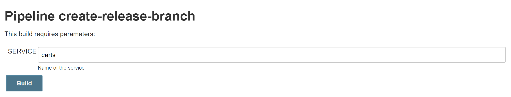
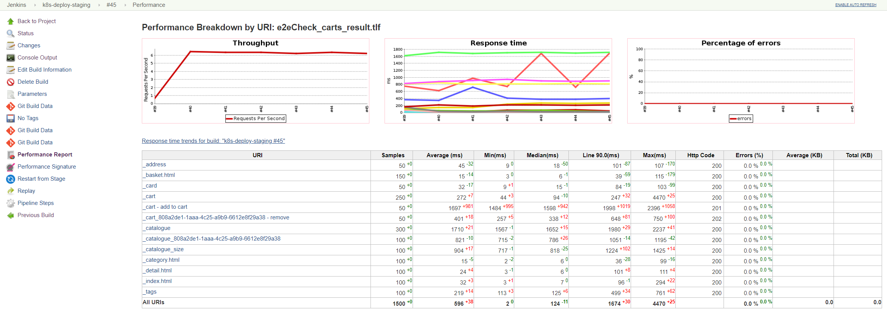
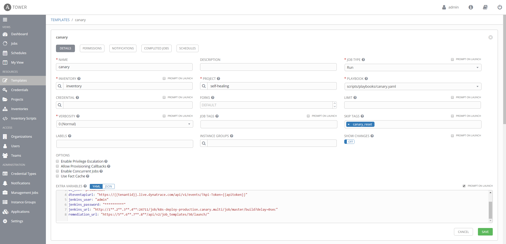
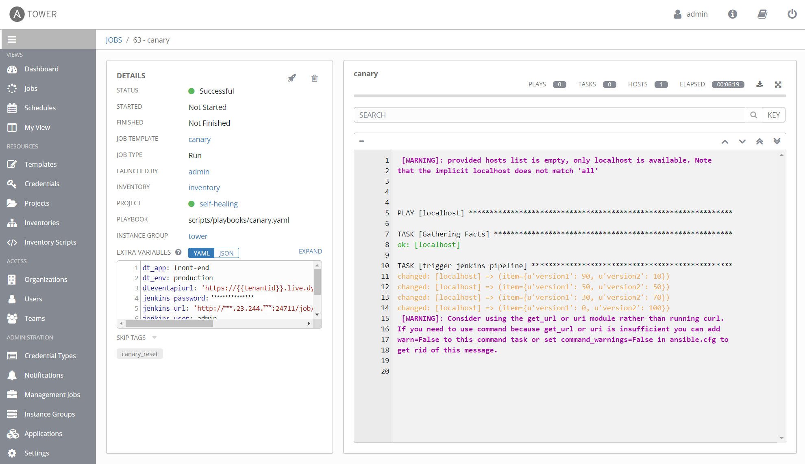
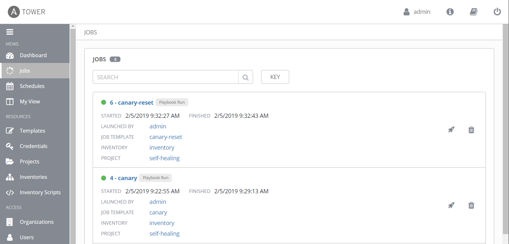

# Unbreakable Delivery Pipeline

This use case shows you how to implement a delivery pipeline that prevents bad code changes from impacting your end users.

## About this use case

The inital goal of the *Unbreakable Delivery Pipeline* is to implement a pipeline that prevents bad code changes from impacting your end users. Therefore, it relies on three concepts known as Shift-Left, Shift-Right, and Self-Healing.

* **Shift-Left**: Ability to pull data for specific entities (processes, services, or applications) through an automation API and feed it into the tools that are used to decide on whether to stop the pipeline or keep it running.

* **Shift-Right**: Ability to push deployment information and meta data to your monitoring solution (e.g., to differentiate BLUE vs GREEN deployments), to push build or revision number of deployment, or to notify about configuration changes.

* **Self-Healing**: Ability for smart auto-remediation that addresses the root cause of a problem and not the symptom.

To illustrate the scenario this use case addresses, two steps are required: 
* (1) The source code of a service will be changed, and the service gets deployed to the development environment. Although the service passes the quality gates in the development environment, the service does not pass the quality gate in staging due to an increase of the response time detected by a performance test. This demonstrates an early break of the delivery pipeline based on automated quality gates. 
* (2) For showcasing the self-healing capabilities a faulty service version is deployed to the production environment and traffic is routed to this new version. Consequently, an issue is detected in production and a problem ticket is opened. To auto-remediate the bad deployment, the traffic routing is changed to redirect traffic to the previous (non-faulty) version.

##### Table of Contents
 * [Step 1: Simulate an early pipeline break](#step-one)
 * [Step 2: Setup self-healing action for production deployment](#step-two)
 * [Step 3: Introduce a failure into front-end and deploy to production](#step-three)
 * [Step 4: Simulate a bad production deployment](#step-four)

## Step 1: Simulate an early pipeline break <a id="step-one"></a>

In this step you'll release a service to staging that is not tested based on performance tests. Intentionally, the service is slowed down to fail at the end-to-end check in the staging pipeline.

1. Introduce a slowdown in the carts service.
    1. In the directory of `~/keptn/repositories/carts/`, open the file: `./src/main/resources/application.properties`
    1. Change the value of `delayInMillis` from `0` to `1000`
    1. Commit/Push the changes to your GitHub Repository *carts*

    ```console
    $ git add .
    $ git commit -m "Property changed"
    $ git push
    ```

1. You need the new version of the carts service in the staging namespace. Therefore, create a new release branch in the carts repository using the Jenkins pipeline `create-release-branch`:
    1. Go to **Jenkins** and **sockshop**.
    1. Click on **create-release-branch** pipeline and **Schedule a build with parameters**.
    1. For the parameter **SERVICE**, enter the name of the service you want to create a release for. In this case: **carts**

        The pipeline does the following:
        1. Reads the current version of the microservice.
        1. Creates a release branch with the name release/**version**.
        1. Increments the current version by 1. 
        1. Commits/Pushes the new version to the Git repository.

        

1. After the `create-release-branch` pipeline has finished, trigger the build pipeline for the carts release and follow the pipeline:
    1. Go to **sockshop**, **carts**, and click on **Scan Multibranch Pipeline Now**.
    1. Open the release build by clicking on the **#no**.
    1. In the **Console Output** wait for *Starting building: k8s-deploy-staging* and click on that link.
    1. The pipeline should fail due to a too high response time. 
    1. Click on **Performance Report** to see the average response time of the URI: *_cart - add to cart*

    

1. Remove the slowdown in the carts service
    1. In the directory of `~/keptn/repositories/carts/`, open the file: `./src/main/resources/application.properties`
    1. Change the value of `delayInMillis` from `1000` to `0`
    1. Commit/Push the changes to your GitHub Repository *carts*

    ```console
    $ git add .
    $ git commit -m "Set delay to 0"
    $ git push
    ```

1. Build this new release
    1. Go to **Jenkins** and **sockshop**.
    1. Click on **create-release-branch** pipeline and **Schedule a build with parameters**.
    1. For the parameter **SERVICE**, enter the name of the service you want to create a release for. In this case: **carts**
    1. After the create-release-branch pipeline has finished, trigger the build pipeline for the carts release.

## Step 2: Setup self-healing action for production deployment <a id="step-two"></a>

In this step you will use an Ansible Tower job to release a deployment in a canary release manner. Additionally, you will create a second job that switches back to the old version in case the *canary* (i.e., the new version of front-end) behaves wrong. 

1. Login to your Ansible Tower instance.

    Receive the public IP from your Ansible Tower:
    ```console
    $ kubectl get services -n tower
    NAME            TYPE           CLUSTER-IP       EXTERNAL-IP     PORT(S)         AGE
    ansible-tower   LoadBalancer   ***.***.***.**   xxx.143.98.xxx   443:30528/TCP   1d
    ```
    
    Copy the `EXTERNAL-IP` into your browser and navigate to https://xxx.143.98.xxx 

1. (If you haven't entered the license yet, see [submit the Ansible Tower license](../runbook-automation-and-self-healing#step-1-verify-installation-of-ansible-tower-).) 
   
1. (If you haven't integrated Ansible Tower into Dynatrace, see [Integration Ansible Tower runbook in Dynatrace](../runbook-automation-and-self-healing#step-2-integration-ansible-tower-runbook-in-dynatrace-).) 

1. Your login is:
    - Username: `admin` 
    - Password: `dynatrace`

1. Verify the existing job template for canary release in Ansible Tower by navigating to **Templates** and **canary**.
    - Name: `canary`
    - Job Type: `Run`
    - Inventory: `inventory`
    - Project: `self-healing`
    - Playbook: `scripts/playbooks/canary.yaml`
    - Skip Tags: `canary_reset`
    - Extra Variables:
      ```
      ---
      jenkins_user: "admin"
      jenkins_password: "AiTx4u8VyUV8tCKk"
      jenkins_url: "http://1**.2**.3**.4**/job/k8s-deploy-production-canary/build?delay=0sec"
      remediation_url: "https://5**.6**.7**.8**/api/v2/job_templates/xx/launch/"
      ``` 
    - Remarks:
        - The IP `1**.2**.3**.4**` in jenkins_url is the IP of your Jenkins.
        - The IP `5**.6**.7**.8**` in remediation_url is the IP of your Ansible Tower.
        - The `xx` before `/launch` is the ID of the job shown in the next step.

    After this step, your job template for *canary*  should look as shown below: 
    

1. Verify the existing job template for canary-reset in Ansible Tower by navigating to **Templates** and **canary-reset**.
    - Name: `canary-reset`
    - Job Type: `Run`
    - Inventory: `inventory`
    - Project: `self-healing`
    - Playbook: `scripts/playbooks/canary.yaml`
    - Job Tags: `canary_reset`
    - Remarks:
        - The IP `1**.2**.3**.4**` in jenkins_url is the IP of your Jenkins.

    After this step, your job template for *canary reset* should look as shown below: 
    

## Step 3: Introduce a failure into front-end and deploy to production <a id="step-three"></a>

In this step you will introduce a Java Script error into the front-end service. This version will be deployed as version `v2`.

1. Edit the file `public/topbar.html` in the master branch of the `~/keptn/repositories/front-end` repository and add the following scripts to the `div class=container` element. 

    ```html
    <div class="container">
        <!-- add dummy errors -->
        <script>
            var waitUntil = Date.now() + 3 * 1000;
            (function lazyWait (){
                while (Date.now () < waitUntil){
                }        
            })();
        </script>
        <script>
            messageBox.getCoolNewMessage ();
        </script>
        <!-- end dummy errors -->
    ...
    ```

1. Change version number from v1 to v2 in the link text in the top bar.
    ```html
    </a> <a href="#">Buy 1000 socks, get a shoe for free - v2</a>
    ```

1. Change the color of the top bar. 
    ```html
    <div class="container" style="background-color:royalblue">
    ```

1. Save the changes to that file.

1. Now it's time to commit your changes. First locally, and then push it to the remote repository.

    ```console
    $ git add .
    $ git commit -m "New messaging feature and more colorful version of front-end service"
    $ git push
    ```

1. You need the new version of the `front-end` service in the *staging* namespace, before you can start with a blue-green or canary deployment. Therefore, create a new release branch in the `front-end` repository using our Jenkins pipeline:

    1. Go to **Jenkins** and **sockshop**.
    1. Click on **create-release-branch** pipeline and **Schedule a build with parameters**.
    1. For the parameter **SERVICE**, enter the name of the service you want to create a release for. In this case: **front-end**

        The pipeline does the following:
        1. Reads the current version of the microservice.
        1. Creates a release branch with the name release/**version**.
        1. Increments the current version by 1. 
        1. Commits/Pushes the new version to the Git repository.

        

1. After the **create-release-branch** pipeline has finished, trigger the build pipeline for the `front-end` service and wait until the new artefacts is deployed to the *staging* namespace.
    - Wait until the release/**version** build has finished.

1. Deploy the new `front-end` to production
    1. Go to your **Jenkins** and click on **k8s-deploy-production.update**.
    1. Click on **master** and **Build with Parameters**:
        * SERVICE: `front-end`
        * VERSION: `v2`
    1. Hit **Build** and wait until the pipeline shows: *Success*.

## Step 4. Simulate a bad production deployment <a id="step-four"></a>

In this step, you will launch the above Ansible job that redirects the entire traffic to the new version of front-end in a canary release manner. Since the new front-end contains a failure, Dynatrace will open a problem and automatically invokes an auto-remediation action.

1. Run the `kubectl get svc istio-ingressgateway -n istio-system` command to get the *EXTERNAL-IP* of your *Gateway*.
    ```console
    $ kubectl get svc istio-ingressgateway -n istio-system
    NAME                   TYPE           CLUSTER-IP       EXTERNAL-IP     PORT(S)                                      AGE
    istio-ingressgateway   LoadBalancer   172.21.109.129   1**.2**.1**.1**  80:31380/TCP,443:31390/TCP,31400:31400/TCP   17h
    ```

1. Simulation of real-user traffic
    1. In your Dynatrace tenant, go to **Synthetic** and click on **Create a synthetic monitor**
    1. Click on **Create a browser monitor**
    1. Type in the *EXTERNAL-IP* of your ingress gateway and give your monitor a name (e.g., Sockshop Monitor).
    1. At *Frequency and locations* set Monitor my website every **5** minutes.
    1. Select all locations and finally click on **Monitor single URL** and **Create browser monitor**.
    1. Now, wait a couple of minutes for the synthetic traffic.

1. Run job template in the Ansible Tower
    1. Go to Ansible Tower.
    1. Start the job template **canary** to trigger a canary release of front-end *v2*.
    

1. (Optional) Adjust sensitivity of anomaly detection
    1. In your Dynatrace tenant, go to **Transaction & service** and click on **front-end.production**.
    1. Click on the **...** button in the top right corner and select **Edit**.
    1. Go to **Anomaly Detection** and enable the switch for *Detect increases in failure rate*.
        * Select `using fixed thresholds`
        * Alert if `2`% custom error rate threshold is exceeded during any 5-minute period.
        * Sensitivity: `High`
    1. Go back to **My web application**.

1. Now, you need to wait until a problem appears in Dynatrace.

1. When Dynatrace opens a problem notification, it automatically invokes the remediation action as defined in the canary playbook. In fact, the remediation action refers to the **remediation** playbook, which then triggers the **canary-reset** playbook. Consequently, you see the executed playbooks when navigating to *Ansible Tower* and *Jobs*. Moreover, the failure rate of the front-end service must decrease since new traffic is routed to the previous version of front-end.
    

## Step 5. Cleanup use case<a id="step-five"></a>

1. Apply the configuration of the **VirtualService** to use v1 only.

    ```console
    $ cd ~/keptn/repositories/k8s-deploy-production/istio
    $ kubectl apply -f virtual_service.yml
    virtualservice.networking.istio.io/sockshop configured
    ```
1. Remove the failure from the front-end service
    1. Edit the file `public/topbar.html` in the master branch of the `~/keptn/repositories/front-end` repository and remove the scripts from the `div class=container` element. 

    ```html
    <div class="container">
        <!-- add dummy errors -->
        <!-- end dummy errors -->
    ...
    ```

    1. Save the changes to that file.

    1. Commit your changes and push it to the remote repository.

        ```console
        $ git add .
        $ git commit -m "Fixed issues with messaging feature"
        $ git push
        ```

## Understanding what happened

In this use case, you 

