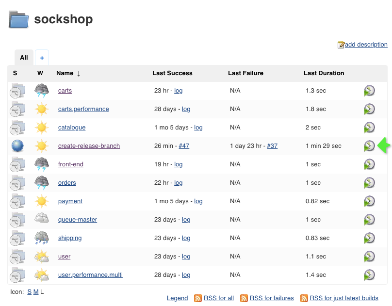
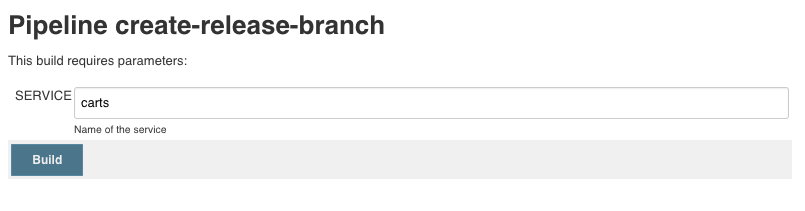

# Unbreakable Delivery Pipeline

The overall goal of the *Unbreakable Delivery Pipeline* is to implement a pipeline that prevents bad code changes from impacting your end users. Therefore, it relies on three concepts known as Shift-Left, Shift-Right, and Self-Healing:

* **Shift-Left**: Ability to pull data for specific entities (processes, services, or applications) through an automation API and feed it into the tools that are used to decide on whether to stop the pipeline or keep it running.

* **Shift-Right**: Ability to push deployment information and meta data to your monitoring environment, e.g., differentiate BLUE vs GREEN deployments, push build or revision number of deployment, or notify about configuration changes.

* **Self-Healing**: Ability for smart auto-remediation that addresses the root cause of a problem and not the symptom.

##### Table of Contents
 * [Step 1: Simulate a early pipeline break](#step-one)
 * [Step 2: Setup self-healing action for production deployment](#step-two)
 * [Step 3: Introduce a failure into front-end and deploy to production](#step-three)
 * [Step 4: Simulate a bad production deployment](#step-four)

## Step 1: Simulate a early pipeline break <a id="step-one"></a>

In this step you'll release a service to staging that is not tested based on performance tests. Intentionally, the service is slowed down to fail at the end-to-end check in the staging pipeline.

1. Introduce a slowdown in the carts service.
    1. In the directory of `~/keptn/repositories/carts/`, open the file: `./src/main/resources/application.properties`
    1. Change the value of `delayInMillis` from `0` to `1000`
    1. Commit/Push the changes to your GitHub Repository *carts*

    ```console
    $ git add .
    $ git commit -m "Property changed"
    $ git push
    ```

1. You need the new version of the carts service in the staging namespace. Therefore, create a new release branch in the carts repository using the Jenkins pipeline `create-release-branch`:
    1. Go to **Jenkins** and **sockshop**.
    1. Click on **create-release-branch** pipeline and **Schedule a build with parameters**.
    1. For the parameter **SERVICE**, enter the name of the service you want to create a release for. In this case: **carts**

        The pipeline does the following:
        1. Reads the current version of the microservice.
        1. Creates a release branch with the name release/**version**.
        1. Increments the current version by 1. 
        1. Commits/Pushes the new version to the Git repository.

        

1. After the `create-release-branch` pipeline has finished, trigger the build pipeline for the carts release and follow the pipeline:
    1. Go to **sockshop**, **carts**, and click on **Scan Multibranch Pipeline Now**.
    1. Open the release build by clicking on the **#no**.
    1. In the **Console Output** wait for *Starting building: k8s-deploy-staging* and click on that link.
    1. The pipeline should fail due to a too high response time. 
    1. Click on **Performance Report** to see the average response time of the URI: *_cart - add to cart*


1. Remove the slowdown in the carts service
    1. In the directory of `~/keptn/repositories/carts/`, open the file: `./src/main/resources/application.properties`
    1. Change the value of `delayInMillis` from `1000` to `0`
    1. Commit/Push the changes to your GitHub Repository *carts*

    ```console
    $ git add .
    $ git commit -m "Set delay to 0"
    $ git push
    ```

1. Build this new release
    1. Go to **Jenkins** and **sockshop**.
    1. Click on **create-release-branch** pipeline and **Schedule a build with parameters**.
    1. For the parameter **SERVICE**, enter the name of the service you want to create a release for. In this case: **carts**
    1. After the create-release-branch pipeline has finished, trigger the build pipeline for the carts release.

## Step 2: Setup self-healing action for production deployment <a id="step-two"></a>

In this step you will create an Ansible Tower job that releases a deployment in a canary release manner. Additionally, you will create a second job that switches back to the old version in case the *canary* (i.e., the new version of front-end) behaves wrong. 

1. To create job template for canary release in Ansible Tower, navigate to **Templates** and create a new Job Template for the canary release mechanism.
    - Name: `canary userX`
    - Job Type: `Run`
    - Inventory: `inventory`
    - Project: `self-healing`
    - Playbook: `workshop/10_.../canary.yml`
    - Skip Tags: `canary_reset`
    - Extra Variables:
      ```
      ---
      jenkins_user: "admin"
      jenkins_password: "admin"
      jenkins_url: "http://1**.2**.3**.4**/job/k8s-deploy-production.canary/build?delay=0sec"
      remediation_url: "https://5**.6**.7**.8**/api/v2/job_templates/xx/launch/"
      ``` 
    - Remarks:
        - The `1**.2**.3**.4**` in jenkins_url need to be replaced by the IP of your Jenkins.
        - The `5**.6**.7**.8**` in remediation_url need to be replaced by the IP of Ansible Tower.
        - The `xx` before /launch need to be replaced by the ID of the job created in the next step.

    After this step, your job template for *canary userX*  should look as shown below: 
    

1. Duplicate the existing job template and change the following values
    - Name: `canary reset userX`
    - Job Tags: `canary_reset`
    - Skip Tags: *remove the value* 

    After this step, your job template for *canary reset userX* should look as shown below: 
    

## Step 3: Introduce a failure into front-end and deploy to production <a id="step-three"></a>

In this step you will introduce a Java Script error into the front-end. This version will be deployed as version `v2`.

1. Make sure you are in the master branch of your front-end.
    ```console
    $ git checkout master
    ```

1. Open file `front-end\public\topbar.html` and add the following scripts to the `div class=container` element. 

    ```
    <div class="container">
        <!-- add dummy errors -->
        <script>
            var waitUntil = Date.now() + 3 * 1000;
            (function lazyWait (){
                while (Date.now () < waitUntil){
                }        
            })();
        </script>
        <script>
            messageBox.getCoolNewMessage ();
        </script>
        <!-- end dummy errors -->
    ...
    ```

1. Change version number from v1 to v2 in the link text in the top bar.
    ```
    </a> <a href="#">Buy 1000 socks, get a shoe for free - v1</a>
    ```

1. Change the color of the top bar. 
    ```
    <div class="container" style="background-color: purple">
    ```

1. Save the changes to that file.

1. Now it's time to commit your changes. First locally, and then push it to the remote repository.

    ```console
    $ git add .
    $ git commit -m "New more colorful version of front-end service"
    $ git push
    ```

1. You need the new version of the `front-end` service in the `staging` namespace, before you can start with a blue-green or canary deployment. Therefore, create a new release branch in the `front-end` repository using the Jenkins pipeline `create-release-branch`:

    1. Go to **Jenkins** and **sockshop**.
    1. Click on **create-release-branch** pipeline and **Schedule a build with parameters**.
    1. For the parameter **SERVICE**, enter the name of the service you want to create a release for **front-end**

        The pipeline does the following:
        1. Reads the current version of the microservice.
        1. Creates a release branch with the name release/**version**.
        1. Increments the current version by 1. 
        1. Commits/Pushes the new version to the Git repository.

        
        

1. After the **create-release-branch** pipeline has finished, trigger the build pipeline for the `front-end` service and and wait until the new artefacts is deployed to the `staging` namespace.

1. Deploy the new front-end to production
    1. Go to your **Jenkins** and click on **k8s-deploy-production.update**.
    1. Click on **master** and **Build with Parameters**:
        * SERVICE: *front-end*
        * VERSION: *v2*
    1. Hit **Build** and wait until the pipeline shows: *Success*.

## Step 4. Simulate a bad production deployment <a id="step-four"></a>

In this step you will create a deployment of the front-end service that passes the quality gate in the staging pipeline and will get deployed to production. Besides, the entire traffic will be be routed to this new version using a prepared deployment pipeline. 

1. Simulation of real-user traffic
    1. In your Dynatrace tenant, go to **Synthetic** and click on **Create a synthetic monitor**
    1. Click on **Create a browser monitor**.
    1. Type in the public IP of your front-end and give your monitor a name (e.g. Sockshop Monitor).
    1. At *Frequency and locations* set Monitor my website every **5** minutes.
    1. Select all Locations and finally click on **Monitor single URL** and **Create browser monitor**.
    1. Now, please wait a couple of minutes.

1. Run job template in the Ansible Tower
    1. Go to Ansible Tower.
    1. Start the job template **canary userX** to trigger a canary release of version 2 of the front-end service.

1. Adjust sensitivity of anomaly detection
    1. Go to **Transaction & service** and click on **front-end- [production]**.
    1. Click on the **...** button in the top right corner and select **Edit**.
    1. Go to **Anomaly Detection** and enable the switch for *Detect increases in failure rate*.
        * Select `using fixed thresholds`
        * Alert if `2`% custom error rate threshold is exceeded during any 5-minute period.
        * Sensitivity: `High`
    1. Go back to **My web application**.

1. Now, you need to wait until a problem appears in Dynatrace.

---

[Use Case: Runbook automation and self-healing](../runbook-automation-and-self-healing) :arrow_backward: 

:arrow_up_small: [Back to keptn](../)